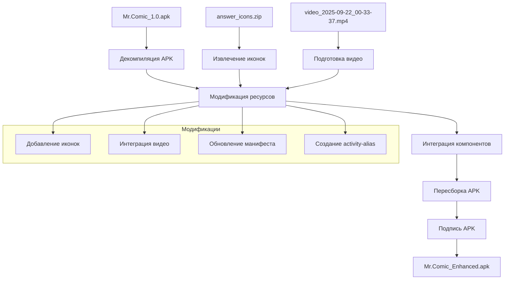
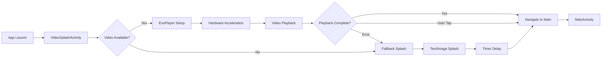
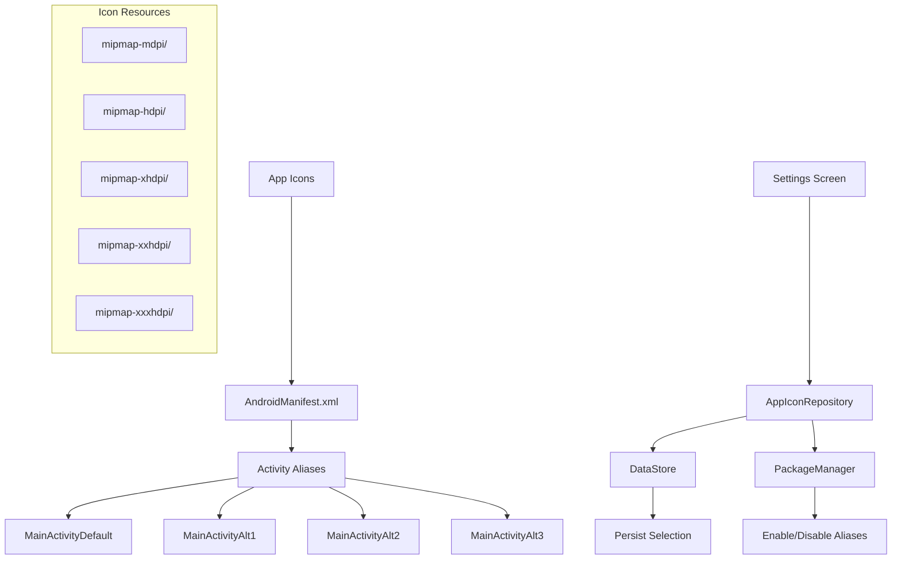

# Проектирование интеграции APK с видео-сплэшскрином и иконками

## Обзор

Данный документ описывает архитектурное решение для создания полнофункционального Android-приложения Mr.Comic путем интеграции существующего рабочего APK с новым видео-сплэшскрином и системой выбора иконок. Решение основано на декомпиляции, модификации и пересборке APK с сохранением всей оригинальной функциональности.

## Архитектура

### Общая архитектура решения



### Архитектура видео-сплэшскрина



### Архитектура системы иконок



## Компоненты и интерфейсы

### 1. APK Декомпилятор и Модификатор

```kotlin
interface ApkModifier {
    fun decompileApk(apkPath: String): DecompiledApk
    fun addResources(apk: DecompiledApk, resources: List<Resource>)
    fun updateManifest(apk: DecompiledApk, manifestChanges: ManifestChanges)
    fun recompileApk(apk: DecompiledApk, outputPath: String)
    fun signApk(apkPath: String, keystore: Keystore)
}

data class DecompiledApk(
    val manifestPath: String,
    val resourcesPath: String,
    val assetsPath: String,
    val libPath: String,
    val classesPath: String
)

data class Resource(
    val type: ResourceType,
    val name: String,
    val path: String,
    val data: ByteArray
)

enum class ResourceType {
    MIPMAP, DRAWABLE, RAW, LAYOUT, VALUES
}
```

### 2. Видео-сплэшскрин компонент

```kotlin
class VideoSplashActivity : ComponentActivity() {
    private lateinit var exoPlayer: ExoPlayer
    private var isVideoReady = false
    
    override fun onCreate(savedInstanceState: Bundle?) {
        super.onCreate(savedInstanceState)
        
        setupFullscreen()
        setupVideoPlayer()
        setupFallbackTimer()
    }
    
    private fun setupVideoPlayer() {
        exoPlayer = ExoPlayer.Builder(this)
            .setVideoScalingMode(C.VIDEO_SCALING_MODE_SCALE_TO_FIT_WITH_CROPPING)
            .build()
            
        val mediaItem = MediaItem.fromUri("android.resource://$packageName/${R.raw.splash_video}")
        exoPlayer.setMediaItem(mediaItem)
        exoPlayer.prepare()
        exoPlayer.playWhenReady = true
        
        exoPlayer.addListener(object : Player.Listener {
            override fun onPlaybackStateChanged(playbackState: Int) {
                when (playbackState) {
                    Player.STATE_READY -> isVideoReady = true
                    Player.STATE_ENDED -> navigateToMain()
                }
            }
            
            override fun onPlayerError(error: PlaybackException) {
                showFallbackSplash()
            }
        })
    }
    
    private fun navigateToMain() {
        startActivity(Intent(this, MainActivity::class.java))
        finish()
    }
}
```

### 3. Система управления иконками

```kotlin
@Singleton
class AppIconRepository @Inject constructor(
    private val context: Context,
    private val dataStore: DataStore<Preferences>
) {
    private val selectedIconKey = stringPreferencesKey("selected_app_icon")
    
    val selectedIcon: Flow<AppIcon> = dataStore.data
        .map { preferences ->
            val iconName = preferences[selectedIconKey] ?: AppIcon.DEFAULT.name
            AppIcon.valueOf(iconName)
        }
    
    suspend fun setAppIcon(icon: AppIcon) {
        // Сохранить выбор
        dataStore.edit { preferences ->
            preferences[selectedIconKey] = icon.name
        }
        
        // Обновить activity aliases
        updateActivityAliases(icon)
    }
    
    private fun updateActivityAliases(selectedIcon: AppIcon) {
        val packageManager = context.packageManager
        
        AppIcon.values().forEach { icon ->
            val componentName = ComponentName(context, icon.activityAlias)
            val newState = if (icon == selectedIcon) {
                PackageManager.COMPONENT_ENABLED_STATE_ENABLED
            } else {
                PackageManager.COMPONENT_ENABLED_STATE_DISABLED
            }
            
            packageManager.setComponentEnabledSetting(
                componentName,
                newState,
                PackageManager.DONT_KILL_APP
            )
        }
    }
}

enum class AppIcon(
    val displayNameRes: Int,
    val activityAlias: String,
    val iconRes: Int
) {
    DEFAULT(R.string.app_icon_default, "MainActivity", R.mipmap.ic_launcher),
    ALTERNATIVE_1(R.string.app_icon_alt1, "MainActivityAlt1", R.mipmap.ic_launcher_alt1),
    ALTERNATIVE_2(R.string.app_icon_alt2, "MainActivityAlt2", R.mipmap.ic_launcher_alt2),
    ALTERNATIVE_3(R.string.app_icon_alt3, "MainActivityAlt3", R.mipmap.ic_launcher_alt3)
}
```

## Модели данных

### 1. Конфигурация APK модификации

```kotlin
data class ApkModificationConfig(
    val sourceApkPath: String,
    val outputApkPath: String,
    val videoSplashPath: String,
    val iconsArchivePath: String,
    val keystorePath: String,
    val keystorePassword: String,
    val keyAlias: String,
    val keyPassword: String
)

data class ModificationResult(
    val success: Boolean,
    val outputApkPath: String?,
    val originalSize: Long,
    val modifiedSize: Long,
    val addedResources: List<String>,
    val errors: List<String>
)
```

### 2. Ресурсы приложения

```kotlin
data class AppResources(
    val icons: Map<String, IconSet>,
    val videos: Map<String, VideoResource>,
    val manifests: ManifestModifications
)

data class IconSet(
    val mdpi: ByteArray,
    val hdpi: ByteArray,
    val xhdpi: ByteArray,
    val xxhdpi: ByteArray,
    val xxxhdpi: ByteArray
)

data class VideoResource(
    val path: String,
    val format: String,
    val duration: Long,
    val size: Long,
    val resolution: Pair<Int, Int>
)

data class ManifestModifications(
    val activityAliases: List<ActivityAlias>,
    val permissions: List<String>,
    val features: List<String>
)
```

## Обработка ошибок

### 1. Стратегия обработки ошибок видео

```kotlin
sealed class VideoSplashError {
    object VideoNotFound : VideoSplashError()
    object UnsupportedFormat : VideoSplashError()
    object PlaybackError : VideoSplashError()
    object HardwareAccelerationUnavailable : VideoSplashError()
}

class VideoSplashErrorHandler {
    fun handleError(error: VideoSplashError): SplashAction {
        return when (error) {
            is VideoSplashError.VideoNotFound -> SplashAction.ShowFallback
            is VideoSplashError.UnsupportedFormat -> SplashAction.ConvertAndRetry
            is VideoSplashError.PlaybackError -> SplashAction.ShowFallback
            is VideoSplashError.HardwareAccelerationUnavailable -> SplashAction.UseSoftwareDecoding
        }
    }
}

sealed class SplashAction {
    object ShowFallback : SplashAction()
    object ConvertAndRetry : SplashAction()
    object UseSoftwareDecoding : SplashAction()
}
```

### 2. Обработка ошибок APK модификации

```kotlin
sealed class ApkModificationError {
    object SourceApkNotFound : ApkModificationError()
    object DecompilatonFailed : ApkModificationError()
    object ResourceAdditionFailed : ApkModificationError()
    object RecompilationFailed : ApkModificationError()
    object SigningFailed : ApkModificationError()
}

class ApkModificationErrorHandler {
    fun handleError(error: ApkModificationError): RecoveryAction {
        return when (error) {
            is ApkModificationError.SourceApkNotFound -> RecoveryAction.RequestValidApk
            is ApkModificationError.DecompilatonFailed -> RecoveryAction.TryAlternativeMethod
            is ApkModificationError.ResourceAdditionFailed -> RecoveryAction.ValidateResources
            is ApkModificationError.RecompilationFailed -> RecoveryAction.CleanAndRetry
            is ApkModificationError.SigningFailed -> RecoveryAction.RegenerateKeystore
        }
    }
}
```

## Стратегия тестирования

### 1. Модульные тесты

```kotlin
class ApkModifierTest {
    @Test
    fun `should successfully decompile valid APK`() {
        // Тест декомпиляции APK
    }
    
    @Test
    fun `should add resources without corruption`() {
        // Тест добавления ресурсов
    }
    
    @Test
    fun `should handle invalid APK gracefully`() {
        // Тест обработки ошибок
    }
}

class VideoSplashTest {
    @Test
    fun `should play video when available`() {
        // Тест воспроизведения видео
    }
    
    @Test
    fun `should fallback when video unavailable`() {
        // Тест fallback режима
    }
    
    @Test
    fun `should handle user interaction correctly`() {
        // Тест пользовательского взаимодействия
    }
}
```

### 2. Интеграционные тесты

```kotlin
class ApkIntegrationTest {
    @Test
    fun `should create functional APK with all components`() {
        // Полный тест интеграции
        val config = ApkModificationConfig(
            sourceApkPath = "Mr.Comic_1.0.apk",
            videoSplashPath = "media/video_2025-09-22_00-33-37.mp4",
            iconsArchivePath = "answer_icons.zip"
        )
        
        val result = apkModifier.modifyApk(config)
        
        assertTrue(result.success)
        assertNotNull(result.outputApkPath)
        assertTrue(File(result.outputApkPath!!).exists())
    }
}
```

### 3. Тесты производительности

```kotlin
class PerformanceTest {
    @Test
    fun `video splash should start within 2 seconds`() {
        // Тест времени запуска видео
    }
    
    @Test
    fun `APK size should not exceed 30MB`() {
        // Тест размера APK
    }
    
    @Test
    fun `memory usage should be optimized`() {
        // Тест использования памяти
    }
}
```

## Оптимизация производительности

### 1. Видео оптимизация

- **Аппаратное ускорение**: Использование GPU для декодирования видео
- **Предзагрузка**: Подготовка видео во время инициализации
- **Кэширование**: Сохранение декодированных кадров в памяти
- **Адаптивное качество**: Выбор разрешения в зависимости от устройства

### 2. APK оптимизация

- **Сжатие ресурсов**: Оптимизация размера изображений и видео
- **Удаление неиспользуемых ресурсов**: Очистка от лишних файлов
- **ProGuard/R8**: Обфускация и минификация кода
- **APK Analyzer**: Анализ и оптимизация размера

### 3. Память и производительность

```kotlin
class PerformanceOptimizer {
    fun optimizeVideoPlayback(): VideoConfig {
        return VideoConfig(
            useHardwareAcceleration = true,
            bufferSize = calculateOptimalBufferSize(),
            preloadFrames = 3,
            releaseResourcesOnPause = true
        )
    }
    
    fun optimizeIconLoading(): IconConfig {
        return IconConfig(
            useVectorDrawables = true,
            cacheInMemory = true,
            lazyLoading = true,
            compressionLevel = 85
        )
    }
}
```

## Совместимость и требования

### Минимальные требования системы

- **Android API Level**: 21 (Android 5.0)
- **RAM**: 2GB минимум, 4GB рекомендуется
- **Свободное место**: 50MB для установки
- **GPU**: Поддержка OpenGL ES 2.0 для видео

### Совместимость устройств

- **Архитектуры**: arm64-v8a, armeabi-v7a, x86, x86_64
- **Разрешения экрана**: от 480x800 до 1440x3200
- **Плотность экрана**: от mdpi до xxxhdpi

### Поддерживаемые форматы

- **Видео**: MP4 (H.264/AVC), WebM (VP8/VP9)
- **Изображения**: PNG, JPEG, WebP
- **Аудио**: AAC, MP3 (для видео со звуком)

## Безопасность

### 1. Подпись APK

```kotlin
data class SigningConfig(
    val keystorePath: String,
    val keystorePassword: String,
    val keyAlias: String,
    val keyPassword: String,
    val signatureAlgorithm: String = "SHA256withRSA"
)

class ApkSigner {
    fun signApk(apkPath: String, config: SigningConfig): Boolean {
        return try {
            val keystore = loadKeystore(config.keystorePath, config.keystorePassword)
            val privateKey = keystore.getKey(config.keyAlias, config.keyPassword.toCharArray())
            val certificate = keystore.getCertificate(config.keyAlias)
            
            signWithKey(apkPath, privateKey, certificate)
            true
        } catch (e: Exception) {
            false
        }
    }
}
```

### 2. Валидация ресурсов

```kotlin
class ResourceValidator {
    fun validateVideo(videoPath: String): ValidationResult {
        return ValidationResult(
            isValid = checkVideoFormat(videoPath) && checkVideoSize(videoPath),
            errors = collectValidationErrors(videoPath)
        )
    }
    
    fun validateIcons(iconsPath: String): ValidationResult {
        return ValidationResult(
            isValid = checkIconFormats(iconsPath) && checkIconSizes(iconsPath),
            errors = collectIconErrors(iconsPath)
        )
    }
}
```

## Развертывание и распространение

### 1. Процесс сборки

```bash
# 1. Декомпиляция исходного APK
apktool d Mr.Comic_1.0.apk -o decompiled/

# 2. Добавление ресурсов
cp -r icons/* decompiled/res/mipmap-*/
cp video.mp4 decompiled/res/raw/splash_video.mp4

# 3. Обновление манифеста
# (автоматически через скрипт)

# 4. Пересборка APK
apktool b decompiled/ -o Mr.Comic_Enhanced_unsigned.apk

# 5. Подпись APK
jarsigner -keystore debug.keystore Mr.Comic_Enhanced_unsigned.apk androiddebugkey

# 6. Выравнивание APK
zipalign -v 4 Mr.Comic_Enhanced_unsigned.apk Mr.Comic_Enhanced.apk
```

### 2. Автоматизация

```kotlin
class BuildAutomation {
    fun buildEnhancedApk(config: BuildConfig): BuildResult {
        return BuildPipeline()
            .step("decompile") { decompileApk(config.sourceApk) }
            .step("add-resources") { addResources(config.resources) }
            .step("update-manifest") { updateManifest(config.manifestChanges) }
            .step("recompile") { recompileApk() }
            .step("sign") { signApk(config.signingConfig) }
            .step("align") { alignApk() }
            .execute()
    }
}
```

Данное проектирование обеспечивает создание полнофункционального приложения с интеграцией всех требуемых компонентов при сохранении оригинальной функциональности и оптимальной производительности.