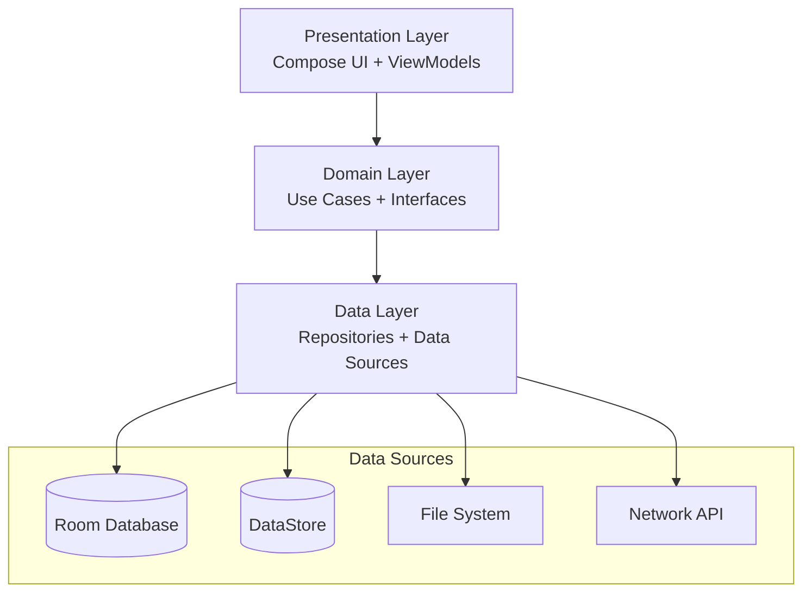
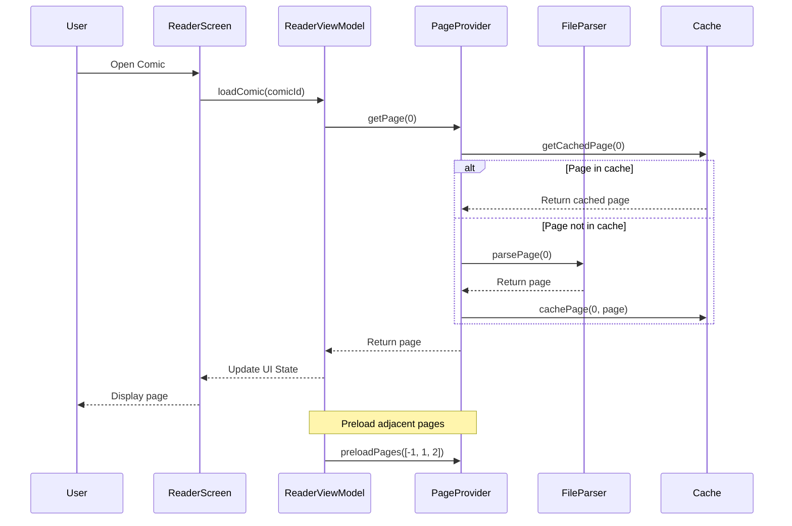
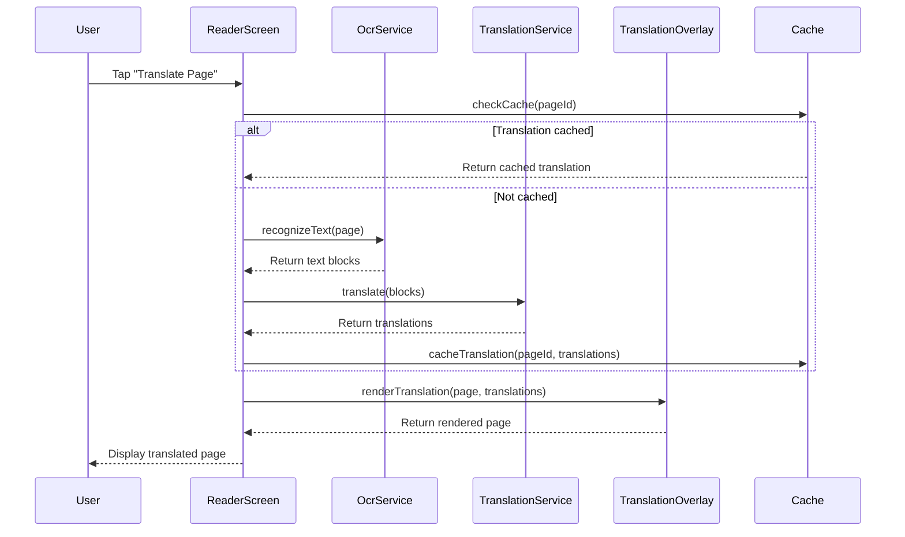

# Дизайн приложения Mr.Comic

## Обзор

Mr.Comic построен на современной Android-архитектуре с использованием Kotlin, Jetpack Compose, Material3 и следует принципам Clean Architecture с модульной структурой. Приложение использует многомодульную архитектуру для разделения ответственности и улучшения масштабируемости.

### Технологический стек

- **Язык**: Kotlin
- **UI Framework**: Jetpack Compose + Material3
- **Dependency Injection**: Hilt (Dagger)
- **Database**: Room
- **Preferences**: DataStore
- **Navigation**: Jetpack Navigation Compose
- **Image Loading**: Coil
- **Networking**: Retrofit + OkHttp
- **Background Work**: WorkManager
- **OCR**: ML Kit / Tesseract
- **Translation**: ONNX Runtime / MarianMT + Cloud APIs
- **Archive Support**: Zip4j, Junrar, Apache Commons Compress
- **PDF Support**: PdfiumAndroid
- **Video**: Media3 ExoPlayer

## Архитектура

### Модульная структура

Приложение организовано в следующие модули:

```
android/
├── app/                          # Главный модуль приложения
├── shared/                       # Общие утилиты и расширения
├── core-analytics/               # Аналитика и логирование
├── core-ui/                      # Общие UI компоненты
├── core-data/                    # Слой данных и репозитории
├── core-model/                   # Модели данных
├── core-reader/                  # Движок чтения (парсинг форматов)
├── feature-library/              # Библиотека комиксов
├── feature-reader/               # Экран чтения
├── feature-settings/             # Настройки приложения
├── feature-themes/               # Система тем и кастомизации
├── feature-onboarding/           # Онбординг
├── feature-ocr/                  # OCR функциональность
└── feature-translate/            # Перевод текста
```

### Архитектурные слои

#### Presentation Layer (UI)
- **Compose Screens**: Декларативный UI с Jetpack Compose
- **ViewModels**: Управление состоянием UI и бизнес-логикой
- **UI State**: Immutable data classes для представления состояния
- **Navigation**: Navigation Compose для навигации между экранами

#### Domain Layer
- **Use Cases**: Инкапсуляция бизнес-логики
- **Domain Models**: Чистые модели без зависимостей от Android
- **Repositories Interfaces**: Абстракции для доступа к данным

#### Data Layer
- **Repositories**: Реализация доступа к данным
- **Data Sources**: Local (Room, DataStore) и Remote (Retrofit)
- **Mappers**: Преобразование между слоями данных

## Компоненты и интерфейсы

### 1. Библиотека комиксов (feature-library)

#### Компоненты
- `LibraryScreen`: Главный экран с отображением коллекции
- `LibraryViewModel`: Управление состоянием библиотеки
- `ComicGridView`: Отображение в виде сетки
- `ComicListView`: Отображение в виде списка
- `FolderView`: Отображение по папкам
- `SearchBar`: Компонент поиска

#### Интерфейсы
```kotlin
interface ComicRepository {
    fun getComics(): Flow<List<Comic>>
    fun getComicsByFolder(folderId: String): Flow<List<Comic>>
    suspend fun addComic(comic: Comic)
    suspend fun removeComic(comicId: String)
    fun searchComics(query: String): Flow<List<Comic>>
}

interface LibraryScanner {
    suspend fun scanDirectory(path: String): ScanResult
    fun observeScanProgress(): Flow<ScanProgress>
    suspend fun cancelScan()
}
```

### 2. Индексация и сканирование (core-data)

#### Компоненты
- `LibraryScanWorker`: WorkManager worker для фонового сканирования
- `FileIndexer`: Индексация файлов комиксов
- `MetadataExtractor`: Извлечение метаданных из файлов
- `CoverCacheManager`: Управление кэшем обложек

#### Интерфейсы
```kotlin
interface FileParser {
    suspend fun parse(file: File): ComicFile
    fun getSupportedFormats(): List<String>
}

interface CoverExtractor {
    suspend fun extractCover(comicFile: ComicFile): Bitmap?
    suspend fun getCachedCover(comicId: String): Bitmap?
}
```

### 3. Ридер (feature-reader)

#### Компоненты
- `ReaderScreen`: Полноэкранный экран чтения
- `ReaderViewModel`: Управление состоянием чтения
- `PageRenderer`: Рендеринг страниц комикса
- `GestureHandler`: Обработка жестов (тап, свайп, зум)
- `PagePreloader`: Предзагрузка соседних страниц
- `PageIndicator`: Индикатор текущей страницы

#### Интерфейсы
```kotlin
interface PageProvider {
    suspend fun getPage(index: Int): Page
    suspend fun getPageCount(): Int
    suspend fun preloadPages(indices: List<Int>)
}

interface GestureDetector {
    fun onTap(position: Offset): GestureAction
    fun onDoubleTap(position: Offset): GestureAction
    fun onLongPress(position: Offset): GestureAction
    fun onSwipe(direction: SwipeDirection): GestureAction
}
```

### 4. Панели управления (feature-reader)

#### Компоненты
- `TopSettingsPanel`: Верхняя панель настроек
- `SideQuickPanel`: Боковые панели быстрых настроек
- `ThumbnailPanel`: Нижняя панель с миниатюрами
- `QuickSettingsOverlay`: Оверлей быстрых настроек

#### Интерфейсы
```kotlin
interface PanelController {
    fun showPanel(panel: PanelType)
    fun hidePanel(panel: PanelType)
    fun togglePanel(panel: PanelType)
    fun observePanelState(): Flow<PanelState>
}

interface ThumbnailProvider {
    suspend fun getThumbnail(pageIndex: Int): Bitmap
    suspend fun getThumbnails(range: IntRange): List<Bitmap>
}
```

### 5. Настройки чтения (feature-settings)

#### Компоненты
- `ReadingSettingsScreen`: Экран настроек чтения
- `ReadingSettingsViewModel`: Управление настройками
- `OrientationController`: Управление ориентацией
- `BrightnessController`: Управление яркостью

#### Интерфейсы
```kotlin
interface ReadingSettingsRepository {
    fun getSettings(): Flow<ReadingSettings>
    suspend fun updateSettings(settings: ReadingSettings)
    suspend fun resetToDefaults()
}

data class ReadingSettings(
    val orientation: Orientation,
    val readingMode: ReadingMode,
    val transitionEffect: TransitionEffect,
    val animationSpeed: Float,
    val doublePage: Boolean,
    val mangaMode: Boolean,
    val localBrightness: Float?,
    val gestureSensitivity: Float,
    val tapZones: TapZoneConfig
)
```

### 6. Кастомизация (feature-themes)

#### Компоненты
- `ThemeSettingsScreen`: Экран настроек темы
- `ThemeEditorScreen`: Редактор пользовательских тем
- `ThemePreviewPanel`: Предпросмотр темы
- `PresetManager`: Управление пресетами

#### Интерфейсы
```kotlin
interface ThemeRepository {
    fun getCurrentTheme(): Flow<AppTheme>
    suspend fun setTheme(theme: AppTheme)
    suspend fun savePreset(name: String, theme: AppTheme)
    fun getPresets(): Flow<List<ThemePreset>>
}

data class AppTheme(
    val mode: ThemeMode,
    val colors: ColorScheme,
    val typography: Typography,
    val shapes: Shapes,
    val overlayAlpha: Float,
    val blurEnabled: Boolean,
    val iconPack: String
)
```

### 7. Синхронизация (core-data)

#### Компоненты
- `SyncManager`: Управление синхронизацией
- `CloudProviderRegistry`: Регистр облачных провайдеров
- `ConflictResolver`: Разрешение конфликтов
- `SyncWorker`: WorkManager worker для фоновой синхронизации

#### Интерфейсы
```kotlin
interface CloudProvider {
    suspend fun upload(data: SyncData): Result<Unit>
    suspend fun download(): Result<SyncData>
    suspend fun getLastSyncTime(): Long?
}

interface SyncRepository {
    suspend fun sync(force: Boolean = false)
    fun observeSyncStatus(): Flow<SyncStatus>
    suspend fun configureSyncSettings(settings: SyncSettings)
}

data class SyncSettings(
    val syncProgress: Boolean,
    val syncBookmarks: Boolean,
    val syncSettings: Boolean,
    val interval: SyncInterval,
    val wifiOnly: Boolean,
    val conflictResolution: ConflictResolutionStrategy
)
```

### 8. OCR (feature-ocr)

#### Компоненты
- `OcrEngine`: Движок распознавания текста
- `TextBlockDetector`: Детектор текстовых блоков
- `LanguageManager`: Управление языковыми моделями
- `OcrCache`: Кэш результатов OCR

#### Интерфейсы
```kotlin
interface OcrService {
    suspend fun recognizeText(image: Bitmap, language: Language): OcrResult
    suspend fun detectTextBlocks(image: Bitmap): List<TextBlock>
    fun getSupportedLanguages(): List<Language>
}

data class OcrResult(
    val text: String,
    val blocks: List<TextBlock>,
    val confidence: Float
)

data class TextBlock(
    val text: String,
    val bounds: Rect,
    val lines: List<TextLine>,
    val confidence: Float
)
```

### 9. Перевод (feature-translate)

#### Компоненты
- `TranslationEngine`: Движок перевода
- `LocalTranslator`: Локальный переводчик (ONNX/MarianMT)
- `CloudTranslator`: Облачный переводчик
- `TranslationCache`: Кэш переводов
- `ModelManager`: Управление моделями перевода

#### Интерфейсы
```kotlin
interface TranslationService {
    suspend fun translate(
        text: String,
        from: Language,
        to: Language
    ): TranslationResult
    
    suspend fun translateBatch(
        texts: List<String>,
        from: Language,
        to: Language
    ): List<TranslationResult>
    
    fun getSupportedLanguages(): List<LanguagePair>
}

interface TranslationProvider {
    val priority: Int
    suspend fun isAvailable(): Boolean
    suspend fun translate(request: TranslationRequest): TranslationResult
}
```

### 10. Визуализация перевода (feature-reader)

#### Компоненты
- `TranslationOverlay`: Слой перевода поверх страницы
- `TextRenderer`: Рендеринг текста перевода
- `BackgroundRenderer`: Рендеринг подложки
- `TranslationLayoutEngine`: Расчёт позиций текста

#### Интерфейсы
```kotlin
interface TranslationOverlayRenderer {
    suspend fun renderTranslation(
        page: Bitmap,
        translations: List<TranslatedBlock>
    ): Bitmap
    
    fun updateSettings(settings: OverlaySettings)
}

data class TranslatedBlock(
    val originalBounds: Rect,
    val translatedText: String,
    val originalText: String
)

data class OverlaySettings(
    val backgroundColor: Color,
    val backgroundAlpha: Float,
    val textColor: Color,
    val fontSize: Float,
    val fontFamily: String
)
```

## Модели данных

### Core Models (core-model)

```kotlin
@Entity(tableName = "comics")
data class Comic(
    @PrimaryKey val id: String,
    val title: String,
    val path: String,
    val format: ComicFormat,
    val coverPath: String?,
    val pageCount: Int,
    val fileSize: Long,
    val addedDate: Long,
    val lastModified: Long,
    val folderId: String?
)

@Entity(tableName = "folders")
data class Folder(
    @PrimaryKey val id: String,
    val name: String,
    val path: String,
    val parentId: String?,
    val comicCount: Int
)

@Entity(tableName = "bookmarks")
data class Bookmark(
    @PrimaryKey val id: String,
    val comicId: String,
    val pageIndex: Int,
    val note: String?,
    val createdAt: Long
)

@Entity(tableName = "reading_sessions")
data class ReadingSession(
    @PrimaryKey val comicId: String,
    val currentPage: Int,
    val totalPages: Int,
    val lastReadAt: Long,
    val readingSettings: String // JSON serialized ReadingSettings
)

enum class ComicFormat {
    CBZ, CBR, ZIP, RAR, PDF, FOLDER
}

enum class Orientation {
    PORTRAIT, LANDSCAPE, AUTO
}

enum class ReadingMode {
    PAGED, VERTICAL_SCROLL
}

enum class TransitionEffect {
    SLIDE, FADE, NONE
}

enum class ThemeMode {
    SYSTEM, LIGHT, DARK, CUSTOM
}

enum class Language {
    RU, EN, FR
}
```

### Database Schema (core-data)

```kotlin
@Database(
    entities = [
        Comic::class,
        Folder::class,
        Bookmark::class,
        ReadingSession::class
    ],
    version = 1,
    exportSchema = true
)
abstract class ComicDatabase : RoomDatabase() {
    abstract fun comicDao(): ComicDao
    abstract fun folderDao(): FolderDao
    abstract fun bookmarkDao(): BookmarkDao
    abstract fun readingSessionDao(): ReadingSessionDao
}

@Dao
interface ComicDao {
    @Query("SELECT * FROM comics ORDER BY addedDate DESC")
    fun getAllComics(): Flow<List<Comic>>
    
    @Query("SELECT * FROM comics WHERE folderId = :folderId")
    fun getComicsByFolder(folderId: String): Flow<List<Comic>>
    
    @Query("SELECT * FROM comics WHERE title LIKE '%' || :query || '%'")
    fun searchComics(query: String): Flow<List<Comic>>
    
    @Insert(onConflict = OnConflictStrategy.REPLACE)
    suspend fun insert(comic: Comic)
    
    @Delete
    suspend fun delete(comic: Comic)
    
    @Query("SELECT * FROM comics WHERE id = :id")
    suspend fun getById(id: String): Comic?
}
```

### DataStore Preferences (core-data)

```kotlin
object PreferencesKeys {
    val THEME_MODE = stringPreferencesKey("theme_mode")
    val LIBRARY_VIEW_MODE = stringPreferencesKey("library_view_mode")
    val READING_ORIENTATION = stringPreferencesKey("reading_orientation")
    val READING_MODE = stringPreferencesKey("reading_mode")
    val MANGA_MODE = booleanPreferencesKey("manga_mode")
    val LOCAL_BRIGHTNESS = floatPreferencesKey("local_brightness")
    val GESTURE_SENSITIVITY = floatPreferencesKey("gesture_sensitivity")
    val OCR_ENABLED = booleanPreferencesKey("ocr_enabled")
    val OCR_LANGUAGE = stringPreferencesKey("ocr_language")
    val TRANSLATION_PROVIDER = stringPreferencesKey("translation_provider")
    val TRANSLATION_SOURCE_LANG = stringPreferencesKey("translation_source_lang")
    val TRANSLATION_TARGET_LANG = stringPreferencesKey("translation_target_lang")
    val AUTO_TRANSLATE = booleanPreferencesKey("auto_translate")
    val SYNC_ENABLED = booleanPreferencesKey("sync_enabled")
    val SYNC_WIFI_ONLY = booleanPreferencesKey("sync_wifi_only")
}
```

## Обработка ошибок

### Стратегия обработки ошибок

1. **Domain Layer**: Использование `Result<T>` для операций, которые могут завершиться ошибкой
2. **UI Layer**: Отображение ошибок через UI State
3. **Background Work**: Логирование и retry стратегии для WorkManager
4. **Crash Reporting**: Интеграция CrashLogger для отслеживания критических ошибок

```kotlin
sealed class UiState<out T> {
    object Loading : UiState<Nothing>()
    data class Success<T>(val data: T) : UiState<T>()
    data class Error(val message: String, val throwable: Throwable? = null) : UiState<Nothing>()
}

sealed class ComicError : Exception() {
    data class FileNotFound(val path: String) : ComicError()
    data class UnsupportedFormat(val format: String) : ComicError()
    data class CorruptedFile(val path: String) : ComicError()
    data class InsufficientPermissions(val permission: String) : ComicError()
    data class NetworkError(val cause: Throwable) : ComicError()
    data class OcrError(val cause: Throwable) : ComicError()
    data class TranslationError(val cause: Throwable) : ComicError()
}
```

### Error Handling Flow

```kotlin
class ComicRepository @Inject constructor(
    private val comicDao: ComicDao,
    private val fileParser: FileParser
) {
    suspend fun addComic(path: String): Result<Comic> = runCatching {
        val file = File(path)
        if (!file.exists()) throw ComicError.FileNotFound(path)
        
        val comicFile = fileParser.parse(file)
        val comic = comicFile.toComic()
        comicDao.insert(comic)
        comic
    }
}

class LibraryViewModel @Inject constructor(
    private val comicRepository: ComicRepository
) : ViewModel() {
    private val _uiState = MutableStateFlow<UiState<List<Comic>>>(UiState.Loading)
    val uiState: StateFlow<UiState<List<Comic>>> = _uiState.asStateFlow()
    
    fun loadComics() {
        viewModelScope.launch {
            _uiState.value = UiState.Loading
            comicRepository.getComics()
                .catch { e ->
                    _uiState.value = UiState.Error(
                        message = "Failed to load comics",
                        throwable = e
                    )
                }
                .collect { comics ->
                    _uiState.value = UiState.Success(comics)
                }
        }
    }
}
```

## Стратегия тестирования

### Unit Tests
- **ViewModels**: Тестирование бизнес-логики и состояний
- **Use Cases**: Тестирование доменной логики
- **Repositories**: Тестирование с mock data sources
- **Parsers**: Тестирование парсинга различных форматов

### Integration Tests
- **Database**: Тестирование Room DAO операций
- **File Operations**: Тестирование чтения/записи файлов
- **OCR/Translation**: Тестирование с реальными моделями

### UI Tests
- **Compose Tests**: Тестирование UI компонентов
- **Navigation**: Тестирование навигации между экранами
- **Gestures**: Тестирование обработки жестов

### Performance Tests
- **Page Loading**: Измерение времени загрузки страниц
- **Scrolling**: Измерение FPS при скроллинге
- **Memory**: Мониторинг использования памяти

```kotlin
@Test
fun `when comic is added, it appears in library`() = runTest {
    // Given
    val comic = createTestComic()
    val repository = ComicRepository(fakeComicDao, fakeFileParser)
    
    // When
    repository.addComic(comic.path)
    
    // Then
    val comics = repository.getComics().first()
    assertTrue(comics.contains(comic))
}

@Test
fun `reader displays correct page count`() {
    composeTestRule.setContent {
        ReaderScreen(comic = testComic)
    }
    
    composeTestRule
        .onNodeWithText("1/${testComic.pageCount}")
        .assertIsDisplayed()
}
```

## Производительность и оптимизация

### Стратегии оптимизации

1. **Image Loading**
   - Использование Coil с кэшированием
   - Downsampling для больших изображений
   - Предзагрузка соседних страниц

2. **Database**
   - Индексы на часто запрашиваемых полях
   - Пагинация для больших списков
   - Использование Flow для реактивных обновлений

3. **Background Work**
   - WorkManager для долгих операций
   - Coroutines для асинхронных операций
   - Cancellation support для прерывания задач

4. **Memory Management**
   - Bitmap pooling для переиспользования памяти
   - Своевременная очистка кэшей
   - Lazy loading компонентов

5. **UI Performance**
   - Compose recomposition optimization
   - LazyColumn/LazyGrid для списков
   - Debouncing для поиска

```kotlin
class PagePreloader @Inject constructor(
    private val pageProvider: PageProvider,
    private val imageLoader: ImageLoader
) {
    private val preloadScope = CoroutineScope(Dispatchers.IO + SupervisorJob())
    
    fun preloadPages(currentIndex: Int, range: Int = 2) {
        preloadScope.launch {
            val indices = (currentIndex - range..currentIndex + range)
                .filter { it >= 0 && it < pageProvider.getPageCount() }
            
            indices.forEach { index ->
                launch {
                    val page = pageProvider.getPage(index)
                    imageLoader.enqueue(
                        ImageRequest.Builder(context)
                            .data(page.uri)
                            .memoryCacheKey(page.cacheKey)
                            .build()
                    )
                }
            }
        }
    }
}
```

## Безопасность и приватность

### Меры безопасности

1. **File Access**: Использование Scoped Storage для Android 10+
2. **Permissions**: Запрос минимально необходимых разрешений
3. **Data Encryption**: Шифрование чувствительных данных в DataStore
4. **Network Security**: HTTPS для всех сетевых запросов
5. **API Keys**: Безопасное хранение ключей API

```kotlin
// Encrypted DataStore для чувствительных данных
val Context.encryptedDataStore: DataStore<Preferences> by preferencesDataStore(
    name = "encrypted_prefs",
    produceMigrations = { context ->
        listOf(SharedPreferencesMigration(context, "encrypted_prefs"))
    }
)
```

## Локализация

### Поддерживаемые языки
- Русский (RU)
- Английский (EN)
- Французский (FR)

### Структура ресурсов
```
res/
├── values/           # Английский (по умолчанию)
├── values-ru/        # Русский
└── values-fr/        # Французский
```

### Динамическая локализация
```kotlin
@Composable
fun LocalizedText(key: String) {
    val context = LocalContext.current
    Text(text = stringResource(id = context.getStringId(key)))
}
```

## Диаграммы

### Архитектура приложения



### Поток чтения комикса



### Поток OCR и перевода



## Решения по дизайну и обоснование

### 1. Модульная архитектура
**Решение**: Разделение на feature-модули и core-модули  
**Обоснование**: Улучшает масштабируемость, позволяет параллельную разработку, упрощает тестирование

### 2. Jetpack Compose
**Решение**: Использование Compose вместо XML Views  
**Обоснование**: Современный декларативный подход, меньше boilerplate кода, лучшая производительность

### 3. Room + DataStore
**Решение**: Room для структурированных данных, DataStore для настроек  
**Обоснование**: Room оптимизирован для сложных запросов, DataStore безопасен для preferences

### 4. Hilt для DI
**Решение**: Использование Hilt вместо Koin или ручного DI  
**Обоснование**: Compile-time проверка, интеграция с Android, меньше runtime ошибок

### 5. Локальный + облачный перевод
**Решение**: Приоритет локальным моделям с fallback на облако  
**Обоснование**: Работа offline, быстрее, приватность данных, облако как backup

### 6. WorkManager для фоновых задач
**Решение**: Использование WorkManager для индексации и синхронизации  
**Обоснование**: Гарантированное выполнение, работа с Doze mode, автоматический retry

### 7. Кэширование на всех уровнях
**Решение**: Кэш обложек, страниц, OCR результатов, переводов  
**Обоснование**: Улучшение производительности, снижение нагрузки, работа offline

### 8. Предзагрузка страниц
**Решение**: Предзагрузка ±2 страниц от текущей  
**Обоснование**: Плавное перелистывание, лучший UX, баланс между памятью и производительностью
