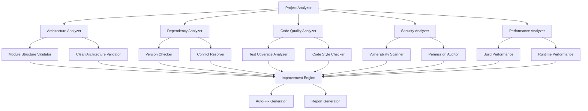

# Дизайн системы анализа и улучшения проекта Mr.Comic

## Обзор

Данный документ описывает архитектуру и дизайн системы для комплексного анализа и улучшения проекта Mr.Comic. Система будет анализировать текущее состояние проекта, выявлять проблемы и автоматически применять улучшения, следуя лучшим практикам Android разработки.

## Архитектура

### Общая архитектура системы анализа



### Модульная структура анализатора

Система анализа будет состоять из следующих компонентов:

1. **Core Analysis Engine** - основной движок анализа
2. **Module Analyzers** - специализированные анализаторы для каждого типа проблем
3. **Fix Generators** - генераторы автоматических исправлений
4. **Report System** - система генерации отчетов

## Компоненты и интерфейсы

### 1. Core Analysis Engine

```kotlin
interface ProjectAnalyzer {
    suspend fun analyzeProject(projectPath: String): AnalysisResult
    suspend fun generateImprovementPlan(result: AnalysisResult): ImprovementPlan
    suspend fun applyImprovements(plan: ImprovementPlan): ApplicationResult
}

data class AnalysisResult(
    val architectureIssues: List<ArchitectureIssue>,
    val dependencyIssues: List<DependencyIssue>,
    val codeQualityIssues: List<CodeQualityIssue>,
    val securityIssues: List<SecurityIssue>,
    val performanceIssues: List<PerformanceIssue>,
    val testCoverage: TestCoverageReport,
    val overallScore: Int
)
```

### 2. Architecture Analyzer

Анализирует архитектуру проекта и соответствие принципам Clean Architecture:

```kotlin
interface ArchitectureAnalyzer {
    fun validateModuleStructure(): List<ModuleIssue>
    fun checkDependencyDirection(): List<DependencyViolation>
    fun validateLayerSeparation(): List<LayerViolation>
    fun checkCircularDependencies(): List<CircularDependency>
}

data class ModuleIssue(
    val module: String,
    val issue: String,
    val severity: Severity,
    val suggestion: String
)
```

### 3. Dependency Analyzer

Анализирует зависимости проекта и предлагает обновления:

```kotlin
interface DependencyAnalyzer {
    suspend fun checkOutdatedDependencies(): List<OutdatedDependency>
    suspend fun findVersionConflicts(): List<VersionConflict>
    suspend fun suggestOptimizations(): List<DependencyOptimization>
    suspend fun checkSecurityVulnerabilities(): List<SecurityVulnerability>
}

data class OutdatedDependency(
    val name: String,
    val currentVersion: String,
    val latestVersion: String,
    val breakingChanges: Boolean,
    val securityFixes: Boolean
)
```

### 4. Code Quality Analyzer

Анализирует качество кода и покрытие тестами:

```kotlin
interface CodeQualityAnalyzer {
    fun analyzeTestCoverage(): TestCoverageReport
    fun checkCodeStyle(): List<StyleViolation>
    fun findCodeSmells(): List<CodeSmell>
    fun analyzeComplexity(): ComplexityReport
}

data class TestCoverageReport(
    val overallCoverage: Double,
    val moduleCoverage: Map<String, Double>,
    val uncoveredFiles: List<String>,
    val criticalUncoveredCode: List<String>
)
```

### 5. Security Analyzer

Анализирует безопасность приложения:

```kotlin
interface SecurityAnalyzer {
    fun scanForVulnerabilities(): List<SecurityVulnerability>
    fun checkPermissions(): List<PermissionIssue>
    fun analyzeDataFlow(): List<DataFlowIssue>
    fun checkEncryption(): List<EncryptionIssue>
}

data class SecurityVulnerability(
    val type: VulnerabilityType,
    val severity: SecuritySeverity,
    val description: String,
    val location: String,
    val fix: String?
)
```

### 6. Performance Analyzer

Анализирует производительность приложения:

```kotlin
interface PerformanceAnalyzer {
    fun analyzeBuildPerformance(): BuildPerformanceReport
    fun checkMemoryUsage(): MemoryUsageReport
    fun analyzeStartupTime(): StartupAnalysisReport
    fun checkImageOptimization(): ImageOptimizationReport
}

data class BuildPerformanceReport(
    val totalBuildTime: Long,
    val slowestTasks: List<SlowTask>,
    val suggestions: List<BuildOptimization>
)
```

## Модели данных

### Основные модели для анализа Mr.Comic проекта

```kotlin
// Специфичные для Mr.Comic модели
data class ComicModuleAnalysis(
    val coreModules: List<ModuleHealth>,
    val featureModules: List<ModuleHealth>,
    val pluginSystem: PluginSystemHealth,
    val ocrIntegration: OCRIntegrationHealth
)

data class ModuleHealth(
    val name: String,
    val dependencies: List<String>,
    val testCoverage: Double,
    val codeQuality: Double,
    val issues: List<ModuleIssue>
)

data class PluginSystemHealth(
    val securityLevel: SecurityLevel,
    val sandboxing: Boolean,
    val apiStability: Double,
    val issues: List<PluginIssue>
)

data class OCRIntegrationHealth(
    val engines: List<OCREngine>,
    val performance: PerformanceMetrics,
    val accuracy: Double,
    val supportedLanguages: List<String>
)
```

## Система исправлений

### Auto-Fix Generator

Генератор автоматических исправлений для различных типов проблем:

```kotlin
interface AutoFixGenerator {
    fun generateArchitectureFixes(issues: List<ArchitectureIssue>): List<ArchitectureFix>
    fun generateDependencyFixes(issues: List<DependencyIssue>): List<DependencyFix>
    fun generateSecurityFixes(issues: List<SecurityIssue>): List<SecurityFix>
    fun generatePerformanceFixes(issues: List<PerformanceIssue>): List<PerformanceFix>
}

sealed class Fix {
    abstract val description: String
    abstract val impact: Impact
    abstract val autoApplicable: Boolean
}

data class DependencyFix(
    override val description: String,
    override val impact: Impact,
    override val autoApplicable: Boolean,
    val oldVersion: String,
    val newVersion: String,
    val gradleChanges: List<GradleChange>
) : Fix()

data class ArchitectureFix(
    override val description: String,
    override val impact: Impact,
    override val autoApplicable: Boolean,
    val moduleChanges: List<ModuleChange>,
    val codeChanges: List<CodeChange>
) : Fix()
```

### Специфичные исправления для Mr.Comic

```kotlin
// Исправления специфичные для проекта Mr.Comic
class MrComicFixGenerator : AutoFixGenerator {
    
    fun fixModuleStructure(): List<ModuleStructureFix> {
        return listOf(
            // Исправление зависимостей между core модулями
            ModuleStructureFix(
                description = "Fix circular dependency between core-data and core-reader",
                changes = listOf(
                    "Move shared interfaces to core-model",
                    "Update imports in affected files"
                )
            ),
            // Оптимизация feature модулей
            ModuleStructureFix(
                description = "Optimize feature module dependencies",
                changes = listOf(
                    "Remove direct dependencies between feature modules",
                    "Use shared interfaces through core modules"
                )
            )
        )
    }
    
    fun fixDependencyVersions(): List<DependencyVersionFix> {
        return listOf(
            DependencyVersionFix(
                library = "androidx.compose.bom",
                currentVersion = "2024.06.00",
                targetVersion = "2024.12.00",
                breakingChanges = false
            ),
            DependencyVersionFix(
                library = "androidx.room",
                currentVersion = "2.7.2",
                targetVersion = "2.8.0",
                breakingChanges = false
            )
        )
    }
    
    fun fixSecurityIssues(): List<SecurityFix> {
        return listOf(
            SecurityFix(
                description = "Add certificate pinning for external API calls",
                location = "core-data/network",
                severity = SecuritySeverity.MEDIUM
            ),
            SecurityFix(
                description = "Encrypt sensitive user data in Room database",
                location = "core-data/database",
                severity = SecuritySeverity.HIGH
            )
        )
    }
}
```

## Система отчетов

### Report Generator

```kotlin
interface ReportGenerator {
    fun generateAnalysisReport(result: AnalysisResult): AnalysisReport
    fun generateImprovementReport(plan: ImprovementPlan): ImprovementReport
    fun generateProgressReport(before: AnalysisResult, after: AnalysisResult): ProgressReport
}

data class AnalysisReport(
    val summary: ReportSummary,
    val detailedFindings: List<Finding>,
    val recommendations: List<Recommendation>,
    val prioritizedActions: List<Action>
)

data class ReportSummary(
    val overallHealth: HealthScore,
    val criticalIssues: Int,
    val warningIssues: Int,
    val infoIssues: Int,
    val testCoverage: Double,
    val securityScore: Double
)
```

## Обработка ошибок

### Стратегия обработки ошибок

```kotlin
sealed class AnalysisError : Exception() {
    data class ProjectNotFound(val path: String) : AnalysisError()
    data class InvalidProjectStructure(val reason: String) : AnalysisError()
    data class DependencyResolutionFailed(val dependency: String) : AnalysisError()
    data class SecurityScanFailed(val reason: String) : AnalysisError()
    data class NetworkError(val service: String) : AnalysisError()
}

class ErrorHandler {
    fun handleAnalysisError(error: AnalysisError): ErrorResponse {
        return when (error) {
            is AnalysisError.ProjectNotFound -> ErrorResponse(
                message = "Project not found at ${error.path}",
                suggestion = "Please check the project path and try again",
                recoverable = true
            )
            is AnalysisError.InvalidProjectStructure -> ErrorResponse(
                message = "Invalid project structure: ${error.reason}",
                suggestion = "Please ensure this is a valid Android project",
                recoverable = false
            )
            // ... другие обработчики
        }
    }
}
```

## Стратегия тестирования

### Unit Testing Strategy

```kotlin
// Тестирование анализаторов
class ArchitectureAnalyzerTest {
    @Test
    fun `should detect circular dependencies`() {
        // Given
        val projectStructure = createTestProjectWithCircularDeps()
        
        // When
        val result = architectureAnalyzer.checkCircularDependencies()
        
        // Then
        assertThat(result).hasSize(1)
        assertThat(result.first().modules).containsExactly("core-data", "core-reader")
    }
}

// Тестирование генераторов исправлений
class AutoFixGeneratorTest {
    @Test
    fun `should generate correct dependency update fixes`() {
        // Given
        val outdatedDeps = listOf(
            OutdatedDependency("androidx.compose.bom", "2024.06.00", "2024.12.00", false, true)
        )
        
        // When
        val fixes = autoFixGenerator.generateDependencyFixes(outdatedDeps)
        
        // Then
        assertThat(fixes).hasSize(1)
        assertThat(fixes.first().autoApplicable).isTrue()
    }
}
```

### Integration Testing Strategy

```kotlin
// Интеграционные тесты для полного цикла анализа
class ProjectAnalysisIntegrationTest {
    @Test
    fun `should analyze real Mr Comic project and generate improvements`() {
        // Given
        val projectPath = "test-projects/mr-comic-sample"
        
        // When
        val analysisResult = projectAnalyzer.analyzeProject(projectPath)
        val improvementPlan = projectAnalyzer.generateImprovementPlan(analysisResult)
        
        // Then
        assertThat(analysisResult.overallScore).isGreaterThan(0)
        assertThat(improvementPlan.fixes).isNotEmpty()
    }
}
```

## Конфигурация и настройки

### Analysis Configuration

```kotlin
data class AnalysisConfig(
    val enabledAnalyzers: Set<AnalyzerType> = AnalyzerType.values().toSet(),
    val securityScanLevel: SecurityScanLevel = SecurityScanLevel.STANDARD,
    val performanceThresholds: PerformanceThresholds = PerformanceThresholds.DEFAULT,
    val autoFixLevel: AutoFixLevel = AutoFixLevel.SAFE_ONLY,
    val reportFormat: ReportFormat = ReportFormat.MARKDOWN,
    val excludePatterns: List<String> = emptyList()
)

enum class AnalyzerType {
    ARCHITECTURE, DEPENDENCY, CODE_QUALITY, SECURITY, PERFORMANCE
}

enum class AutoFixLevel {
    NONE, SAFE_ONLY, MODERATE, AGGRESSIVE
}
```

## Интеграция с внешними сервисами

### External Service Integration

```kotlin
// Интеграция с сервисами для получения информации о зависимостях
interface DependencyInfoService {
    suspend fun getLatestVersion(dependency: String): String?
    suspend fun getSecurityAdvisories(dependency: String): List<SecurityAdvisory>
    suspend fun getChangeLog(dependency: String, fromVersion: String, toVersion: String): ChangeLog?
}

// Интеграция с сервисами анализа безопасности
interface SecurityScanService {
    suspend fun scanDependencies(dependencies: List<Dependency>): List<SecurityVulnerability>
    suspend fun scanCode(codeFiles: List<String>): List<SecurityIssue>
}
```

## Производительность и масштабируемость

### Performance Considerations

1. **Параллельный анализ**: Различные анализаторы работают параллельно
2. **Кэширование результатов**: Результаты анализа кэшируются для повторного использования
3. **Инкрементальный анализ**: Анализируются только измененные части проекта
4. **Ленивая загрузка**: Детальный анализ выполняется только при необходимости

```kotlin
class PerformantProjectAnalyzer : ProjectAnalyzer {
    private val cache = AnalysisCache()
    private val executor = Executors.newFixedThreadPool(4)
    
    override suspend fun analyzeProject(projectPath: String): AnalysisResult {
        val cacheKey = generateCacheKey(projectPath)
        
        return cache.get(cacheKey) ?: run {
            val futures = listOf(
                executor.submit { architectureAnalyzer.analyze() },
                executor.submit { dependencyAnalyzer.analyze() },
                executor.submit { codeQualityAnalyzer.analyze() },
                executor.submit { securityAnalyzer.analyze() }
            )
            
            val results = futures.map { it.get() }
            val combinedResult = combineResults(results)
            
            cache.put(cacheKey, combinedResult)
            combinedResult
        }
    }
}
```

Этот дизайн обеспечивает комплексный анализ проекта Mr.Comic с возможностью автоматического исправления выявленных проблем, следуя принципам модульности, тестируемости и производительности.