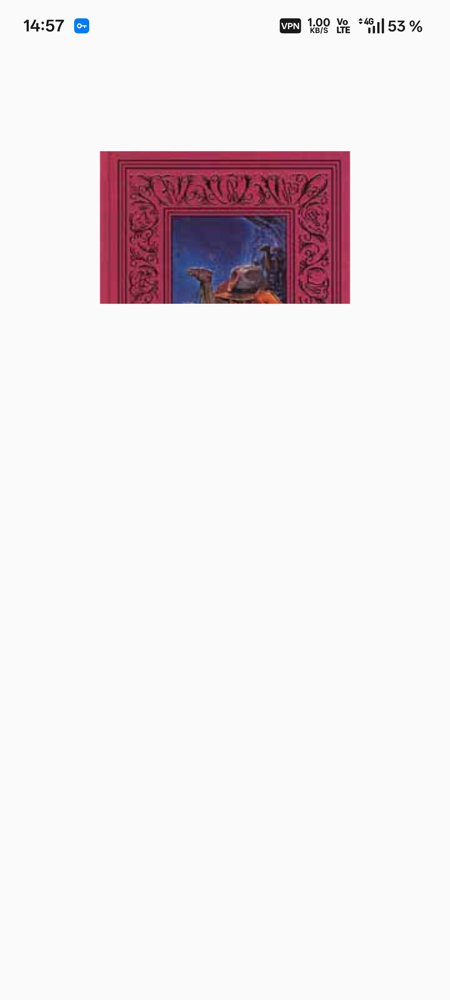
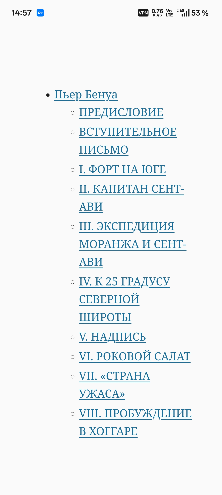
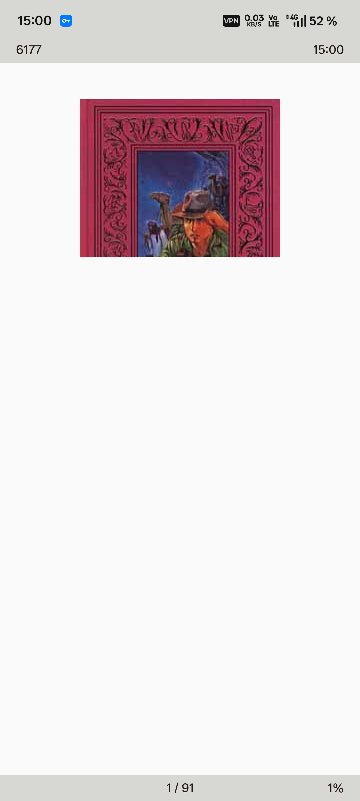
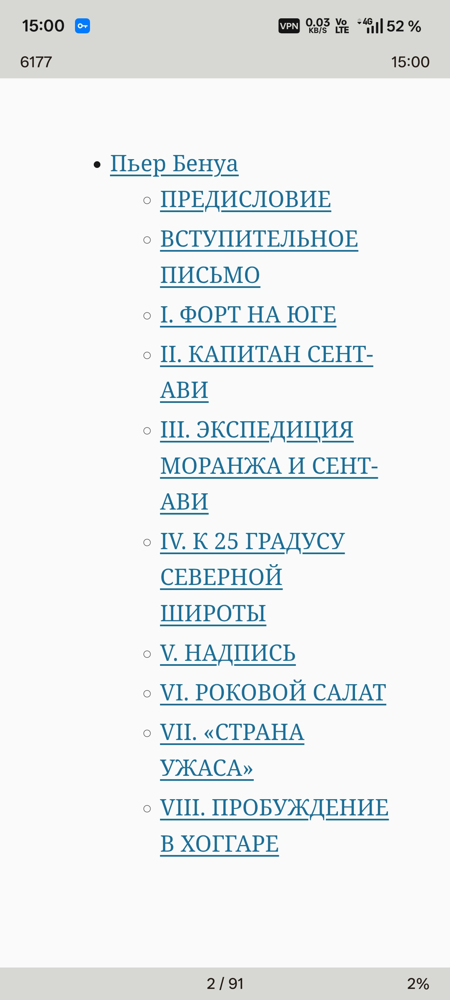

<div align="center">
  <h1>Mr.Comic</h1>

  <p>
    <b>Android-ридер для комиксов, манги, вебтунов, книг, аудиокниг с OCR и переводами.</b><br>
    Модульное Kotlin-приложение: растровые страницы, reflowable-книги, локальные словари, TTS и кастомизация чтения.
  </p>

  <p>
    <a href="https://github.com/Leostrange/Mr.Comic/releases/tag/v2.1.0">
      
    </a>
    
    
    
    
    
  </p>

  <p>
    <a href="https://github.com/Leostrange/Mr.Comic/releases/tag/v2.1.0"><b>Скачать релиз</b></a>
    ·
    <a href="docs/README.md">Документация</a>
    ·
    <a href="docs/RECOMMENDATIONS.md">Рекомендации по коду</a>
    ·
    <a href="THIRD_PARTY_NOTICES.md">Сторонние лицензии</a>
  </p>
</div>

---

## Содержание

- [О проекте](#о-проекте)
- [Возможности](#возможности)
- [Поддерживаемые форматы](#поддерживаемые-форматы)
- [Скриншоты](#скриншоты)
- [Технологии](#технологии)
- [Структура проекта](#структура-проекта)
- [Сборка](#сборка)
- [CI/CD](#cicd)
- [Лицензия](#лицензия)

---

## О проекте

Mr.Comic — Android-ридер для комиксов, манги, вебтунов, книг, аудиокниг с OCR-переводами, словарями и кастомизируемым интерфейсом библиотеки.

Ридер построен на отдельных контейнерах для растровых страниц, вертикальных лент, текстовых страниц и вертикального текста. Это позволяет каждому формату использовать оптимальный путь рендеринга.

## Возможности

| Категория | Описание |
|-----------|----------|
| **Комиксы и манга** | CBR, CBZ, ZIP, RAR, 7Z, TAR, папки с изображениями, PDF, DJVU — постраничный и вертикальный режимы |
| **Книги** | EPUB, FB2, TXT, HTML, Markdown, RTF, MOBI, AZW3, DOCX, ODT — пагинация и webtoon-поток |
| **Инструменты чтения** | TOC-навигация, закладки, прогресс, цитаты, сноски, словарный поиск, перевод, LLM-объяснения |
| **Стили чтения** | Paper, sepia, newspaper, night ink, OLED black, e-ink пресеты + типографика и кастомные шрифты |
| **Аудио и OCR** | TTS, воспроизведение аудиокниг, медиа-контролы, OCR-входные точки |
| **Переводы** | Оффлайн-словари (WordNet, JMdict, CC-CEDICT, Kaikki), онлайн-перевод, OpenRouter LLM |

## Поддерживаемые форматы

| Категория | Форматы |
|-----------|---------|
| Растровые | CBR, CBZ, ZIP, RAR, 7Z, TAR, PDF, DJVU, папки с изображениями |
| Текстовые | EPUB, FB2, TXT, HTML, Markdown, RTF, MOBI, AZW3, DOCX, ODT |
| Аудио | Локальные аудиокниги через Media3 |

Архивы классифицируются перед рендерингом: последовательности изображений используют растровые контейнеры; текстовые книги внутри архивов делегируются соответствующему текстовому ридеру.

## Скриншоты

<div align="center">
  
  
  
  
</div>

## Технологии

| Слой | Технологии |
|------|-----------|
| Язык | Kotlin, Java 17 toolchain |
| UI | Jetpack Compose, Material 3 |
| Архитектура | Модульное Android-приложение (16 модулей), MVVM + StateFlow |
| DI | Hilt |
| Хранение | Room (v9, 8 миграций), DataStore |
| Медиа | Android Media3 |
| Изображения | Coil |
| Сеть | Retrofit, OkHttp |
| Архивы | Zip4j, Junrar, Apache Commons Compress |
| EPUB | Readium-ориентированный движок + формат-адаптеры |
| Сборка | Gradle wrapper, AGP 9.2.1, Kotlin 2.2.21 |
| CI | GitHub Actions (тесты всех модулей + lint + сборка APK) |

## Структура проекта

```text
├── android/
│   ├── app/                   → Точка входа, навигация, DI-корень
│   ├── core-model/            → Общие модели, каталог форматов, enum'ы
│   ├── core-data/             → Room, DataStore, репозитории, миграции
│   ├── core-domain/           → Доменная логика, перевод, словари, аналитика
│   ├── core-ui/               → Тема, дизайн-примитивы, shared UI
│   ├── engine-api/            → Граничные интерфейсы движков чтения
│   ├── engine-epub-readium/   → Интеграция EPUB/Readium
│   ├── engine-formats/        → Ридеры форматов: архивы, EPUB, FB2, PDF, DJVU...
│   ├── engine-llm/            → LLM-интеграция (OpenRouter)
│   ├── engine-registry/       → Регистрация и обнаружение движков
│   ├── engine-rendering/      → Кэш битмапов, предзагрузка, рендеринг
│   ├── feature-library/       → Библиотека, импорт, аудиоплеер, прогресс
│   ├── feature-reader/        → Экран чтения, контейнеры, TTS, жесты
│   ├── feature-settings/      → Настройки и кастомизация
│   ├── feature-ocr/           → OCR-модуль
│   └── feature-onboarding/    → Онбординг
├── docs/                      → Документация и рекомендации
├── samples/                   → Тестовые файлы форматов
├── scripts/                   → Вспомогательные скрипты (импорт словарей)
├── Translate/                 → Скрипты сборки словарей
└── Screenshots/               → Скриншоты приложения
```

## Сборка

### Требования

- Android Studio (последняя стабильная)
- Android SDK (compileSdk 37)
- JDK 17
- Gradle wrapper из репозитория

### Сборка Debug APK

```bash
# Linux / macOS
./gradlew --no-daemon --console=plain :app:assembleDebug

# Windows
.\gradlew.bat --no-daemon --console=plain :app:assembleDebug
```

Результат: `android/app/build/outputs/apk/debug/Mr.Comic-debug.apk`

### Запуск тестов

```bash
# Все модули
./gradlew --no-daemon testDebugUnitTest

# Конкретный модуль
./gradlew --no-daemon :engine-formats:testDebugUnitTest
./gradlew --no-daemon :feature-reader:testDebugUnitTest
```

## CI/CD

GitHub Actions workflow (`.github/workflows/build-apk.yml`):

| Job | Описание |
|-----|----------|
| `unit-tests` | Запуск unit-тестов **всех 16 модулей** |
| `lint` | Android Lint для `:app` |
| `build` | Сборка Debug + Release APK (после прохождения тестов и lint) |
| `python-scripts` | Smoke-тест скриптов сборки словарей |

Триггеры: push в `main`, pull request в `main`, ручной запуск.

## Лицензия

Исходный код Mr.Comic опубликован как **source-available**. Подробности в [LICENSE](LICENSE).

Сторонние библиотеки, компоненты Android, словари и ассеты остаются под своими лицензиями. См. [THIRD_PARTY_NOTICES.md](THIRD_PARTY_NOTICES.md).
