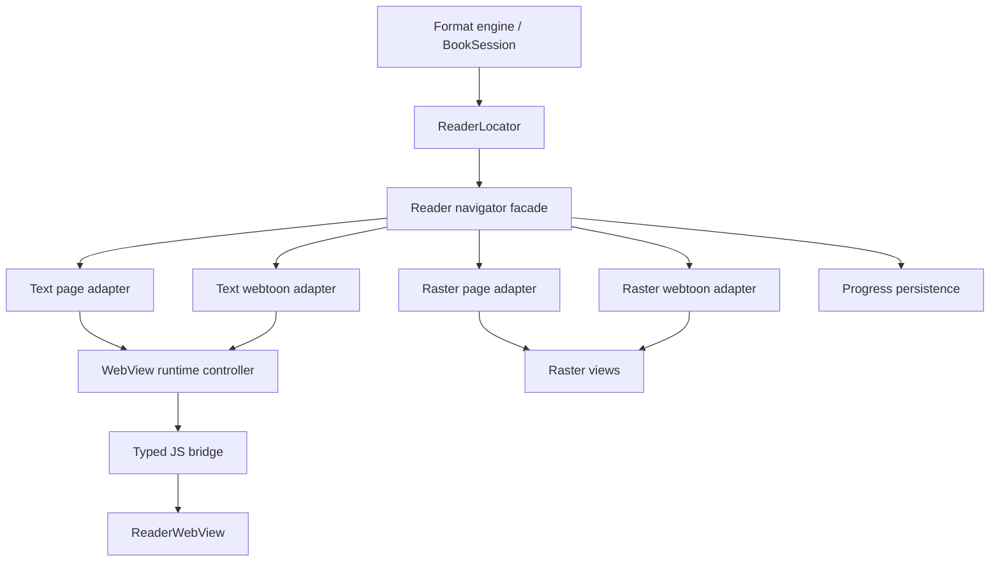
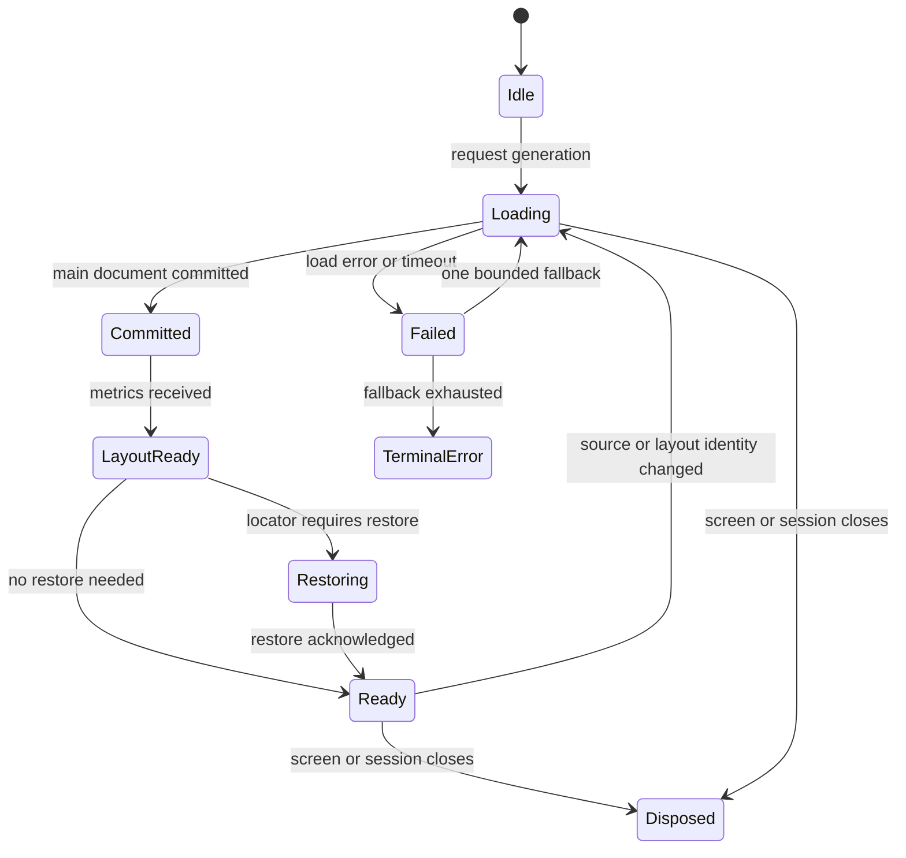
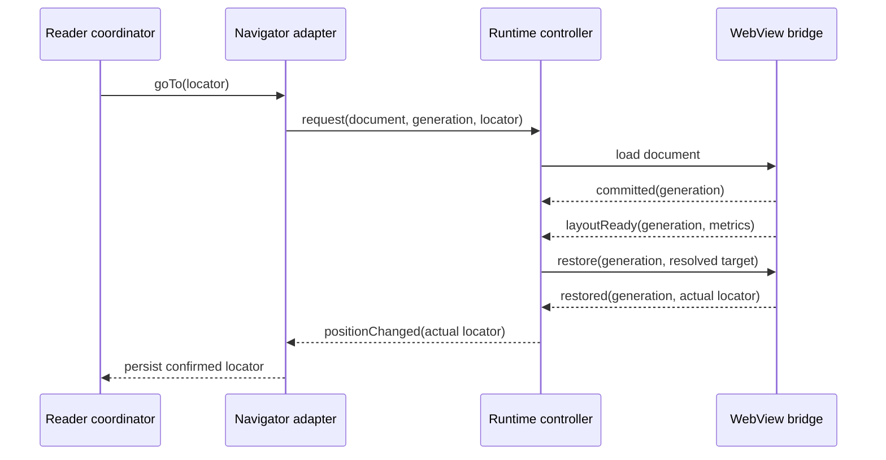

# refactor: Stabilize Reader runtime and restore

## Summary

План стабилизирует Reader Core до дальнейшего расширения продукта. Работа последовательно закрывает WebView lifecycle, восстановление позиции, общий навигационный контракт четырёх контейнеров и реальную матрицу форматов на устройстве.

Последняя подтверждённая база проекта — 1560 unit-тестов без failures/errors и 0 detekt issues. Это сильная защита pure-логики, но не доказательство runtime-корректности WebView, переключения PAGE/WEBTOON и повторного открытия книги.

## Execution status — 2026-08-12

| Unit | Implementation | Verification |
|---|---|---|
| U1-U4 | Complete | Contract/unit tests and instrumentation compilation pass. |
| U5 | Complete | `HtmlPageView` reduced to 345 lines; reader unit tests and detekt pass; app compiles. |
| U6 | Corpus and production-reader matrix complete | All 11 formats are represented by checksum-pinned real/generated fixtures; instrumentation compiles. Device execution is blocked because both listed ADB transports time out on `adb shell`. |
| U7 | Release-tier 30-cycle WebView lifecycle soak implemented | Instrumentation compiles; no runtime or performance PASS is claimed until a responsive device is available. |
| U8 | PR smoke/release runtime CI tiers configured | Workflow YAML validates locally; the new jobs have not yet been executed remotely. |

Current local verification: 535 `feature-reader` unit tests, 0 failures/errors/skips; `:feature-reader:detekt`, `:feature-reader:compileDebugAndroidTestKotlin`, and `:app:compileDebugKotlin` are successful.

---

## Problem Frame

Reader уже разделяет контент на `TEXT_PAGE`, `TEXT_WEBTOON`, `RASTER_PAGE` и `RASTER_WEBTOON`, имеет контроллеры открытия, навигации и прогресса, а также существующие `ReaderLocator`, `ReaderWebViewLoadController` и `ReaderWebtoonRestorePolicy`. Главный риск находится не в отсутствии слоёв, а в незавершённом runtime-срезе:

- `HtmlPageView.kt` остаётся 870-строчной точкой, где смешаны Compose lifecycle, создание WebView, загрузка документа, callbacks, JS, fallback и restore;
- `ReaderWebView.kt` и `ReaderPagedLayoutJs.kt` содержат соответственно около 822 и 774 строк взаимозависимого runtime-кода;
- текущий load-token защищает часть поздних callbacks, но не моделирует полный цикл request -> commit -> layout ready -> restore -> acknowledged;
- позиция представлена несколькими координатами: page, engine section, split, page-in-split, character offset, fragment и progression;
- unit-тесты характеризуют отдельные политики, но нет обязательной device-матрицы, которая доказывает отсутствие blank surface, reload-loop и потери позиции на реальных книгах.

Readium показывает полезную границу между publication/session, locator и специализированными navigator-реализациями. KOReader подтверждает ценность узких runtime-модулей вокруг перелистывания, bookmarks и конфигурации. Из Librera стоит брать зрелость форматной матрицы, но не более монолитную связность. Mr.Comic не должен копировать другой reader целиком: существующие четыре контейнера сохраняются, а общий контракт ограничивается навигацией, позицией и lifecycle.

---

## Requirements

**Runtime correctness**

- R1. Один document generation проходит не более одного активного load-цикла; поздний callback старого generation не меняет экран и позицию.
- R2. Restore выполняется только после commit и подтверждения готовности layout, не более одного раза для generation.
- R3. Blank-document fallback ограничен одной контролируемой попыткой и не создаёт reload-loop.
- R4. Выход из Reader освобождает WebView, callbacks, delayed tasks и открытый session без сохранения ссылок на предыдущую книгу.

**Navigation and progress**

- R5. `ReaderLocator` становится единственной межслойной моделью позиции; container-specific координаты преобразуются адаптерами, а не проникают в engine contracts.
- R6. PAGE -> WEBTOON -> PAGE сохраняет ту же semantic section и позицию с допустимой погрешностью для reflowable текста.
- R7. Холодное повторное открытие восстанавливает raster page точно, а text position — в той же section с отклонением progression не более 0.02.
- R8. Progress и completion обновляются только из подтверждённой позиции активного navigator; обложка и первая незавершённая пагинация не дают ложные 100%.

**Format and device quality**

- R9. Матрица включает EPUB, FB2, HTML, TXT, DOCX, текстовый архив, CBZ, CBR, PDF, DJVU и папку изображений в поддерживаемых PAGE/WEBTOON режимах.
- R10. Для каждого формата проверяются cold open, последовательная навигация, граница главы/конца, background/foreground, смена режима и reopen.
- R11. Device QA проверяет минимум один representative min-SDK device, текущий основной target device и API 37 после восстановления стенда.
- R12. Runtime-регрессии имеют воспроизводимые fixtures, структурированные события и сохранённый QA-отчёт, а не только ручное утверждение.

**Architecture and delivery**

- R13. `HtmlPageView` остаётся Compose wiring-компонентом; решения load/restore/fallback и JS protocol живут в тестируемых классах.
- R14. Engines остаются Android/Compose-независимыми и не получают форматных исключений из Reader UI.
- R15. Каждый behavioral slice добавляется characterization-first и проходит targeted unit/instrumented tests до удаления старого пути.
- R16. Полная проверка включает все затронутые `testDebugUnitTest`, detekt и `:app:compileDebugKotlin` через `gradlew.bat`.

---

## Scope Boundaries

### In scope

- lifecycle, load generation, readiness, restore и fallback текстового WebView;
- canonical locator и адаптеры четырёх Reader containers;
- сохранение позиции при mode switch, process recreation и reopen;
- typed Kotlin/JavaScript boundary для pagination, metrics, anchors и errors;
- воспроизводимая форматная QA-матрица, runtime observability и regression gates;
- уменьшение `HtmlPageView`, `ReaderWebView` и `ReaderPagedLayoutJs` только в объёме, нужном для runtime-контрактов.

### Deferred to Follow-Up Work

- дальнейший разрез `ReaderScreen` и chrome composables, если он не нужен для подключения navigator;
- декомпозиция крупных localization-файлов и дизайн-системы;
- ускорение или переписывание отдельных format parsers после того, как матрица покажет конкретную проблему;
- расширение AI, OCR, Library, gamification и визуальных настроек;
- macrobenchmark-модуль, если имеющегося instrumentation harness недостаточно для стабильных метрик.

### Explicit non-goals

- перенос format parsing или asset resolution в UI;
- замена всех движков Readium либо внедрение Readium Navigator для не-EPUB форматов;
- унификация четырёх контейнеров в один универсальный renderer;
- UI redesign Reader и изменение пользовательских жестов без отдельного требования;
- big-bang rewrite без работающего compatibility path.

---

## Key Technical Decisions

- KTD1. **Развивать существующий `ReaderLocator`, а не создавать второй тип позиции:** модель уже находится в `core-model` и используется `BookSession`; дублирование усилит рассинхронизацию legacy `FormatReader` и нового engine API.
- KTD2. **Общий navigator-контракт ограничить position/navigation/lifecycle:** rendering остаётся специализированным для четырёх контейнеров, как специализированные navigators в Readium.
- KTD3. **Runtime lifecycle представить конечным автоматом:** hash содержимого недостаточен как identity; load получает document identity и монотонный generation, а все callbacks несут generation.
- KTD4. **Restore подтверждается двухфазно:** WebView сначала сообщает document commit, затем layout-ready с метриками; только после этого controller выдаёт один restore effect и ждёт acknowledgement.
- KTD5. **JavaScript сделать протоколом, а не набором inline-строк:** команды и события типизируются на Kotlin-стороне, payload валидируется, а неизвестная версия/ошибка приводит к контролируемому failure event.
- KTD6. **Canonical locator хранит semantic и fallback координаты:** предпочтение отдаётся href/fragment и section anchor, затем character offset/split, затем progression/page fallback.
- KTD7. **Migration идёт вертикальными slices с compatibility adapter:** старый restore удаляется только после parity-тестов для соответствующего контейнера.
- KTD8. **Device matrix является release gate:** unit tests остаются обязательными, но не могут закрыть RDR-01..RDR-05 без runtime evidence.

---

## High-Level Technical Design

### Component topology

### WebView lifecycle state

### Restore sequence

---

## Phased Delivery

| Phase | Units | Exit gate |
|---|---|---|
| 0. Characterization | U1 | Existing behavior and failures are reproducible without changing production semantics. |
| 1. Runtime seam | U2, U3 | Load/commit/layout/restore/fallback is deterministic and generation-safe. |
| 2. Navigation seam | U4, U5 | All four containers expose and consume canonical locators; legacy restore is removed. |
| 3. Evidence | U6, U7 | Full format/device matrix and soak metrics pass. |
| 4. Enforcement | U8 | CI/release documentation prevents regression and records evidence. |

---

## Implementation Units

### U1. Characterize runtime behavior and establish the QA corpus

- **Estimate:** 5 story points.
- **Goal:** Зафиксировать существующие load/restore transitions и создать license-clean corpus для повторяемой runtime-проверки.
- **Requirements:** R1-R4, R9-R12, R15.
- **Dependencies:** none.
- **Files:**
  - Modify `android/feature-reader/src/test/java/io/leostrange/mrcomic/feature/reader/ui/ReaderWebViewLoadControllerTest.kt`.
  - Modify `android/feature-reader/src/test/java/io/leostrange/mrcomic/feature/reader/ui/ReaderWebViewRegressionTest.kt`.
  - Modify `android/feature-reader/src/androidTest/java/io/leostrange/mrcomic/feature/reader/harness/WebViewTestRunner.kt`.
  - Create `android/feature-reader/src/androidTest/java/io/leostrange/mrcomic/feature/reader/harness/ReaderRuntimeEventProbe.kt`.
  - Create `android/feature-reader/src/androidTest/assets/reader-corpus/manifest.json` and license-clean fixtures listed by it.
  - Create `docs/qa/reader-runtime-matrix.md`.
- **Approach:** Сначала добавить наблюдение без смены решений runtime. Manifest хранит format, provenance, checksum, expected sections/pages и feature flags fixture; generated fixtures допускаются для TXT/HTML/FB2, бинарные fixtures должны иметь явную лицензию.
- **Execution note:** Characterization-first; зафиксировать воспроизводимый failing scenario для PAGE -> WEBTOON -> PAGE и late callback до рефакторинга.
- **Patterns to follow:** `PaginationConsistencyTest.kt`, `EpubCorpusSmokeTest.kt`, `ArchiveTextRoutingMatrixTest.kt`.
- **Test scenarios:**
  1. Два load requests A/B и поздний commit A: probe фиксирует callback A, но экран и active generation остаются B.
  2. Один документ рекомпозируется без изменения source/layout identity: второй load не начинается.
  3. Fixture manifest отклоняет отсутствующий файл, неверный checksum и неизвестный format.
  4. Минимальный EPUB/FB2/HTML/TXT/DOCX и raster fixture открывается harness-ом и публикует non-empty readiness evidence.
  5. PAGE -> WEBTOON -> PAGE сохраняет исходную semantic section на контрольном EPUB.
- **Verification:** Есть одна команда/runner, формирующая одинаковый event trace и matrix row; production behavior до U2 не изменён.

### U2. Complete the WebView runtime state machine

- **Estimate:** 8 story points.
- **Goal:** Расширить частичный `ReaderWebViewLoadController` до полного generation-safe автомата без Android/Compose зависимостей.
- **Requirements:** R1-R4, R13, R15.
- **Dependencies:** U1.
- **Files:**
  - Modify `android/feature-reader/src/main/java/io/leostrange/mrcomic/feature/reader/ui/ReaderWebViewLoadController.kt`.
  - Create `android/feature-reader/src/main/java/io/leostrange/mrcomic/feature/reader/ui/ReaderWebViewRuntimeState.kt`.
  - Create `android/feature-reader/src/main/java/io/leostrange/mrcomic/feature/reader/ui/ReaderWebViewRuntimeEffect.kt`.
  - Modify `android/feature-reader/src/test/java/io/leostrange/mrcomic/feature/reader/ui/ReaderWebViewLoadControllerTest.kt`.
- **Approach:** Controller принимает события и возвращает effects; состояние включает document identity, generation, load attempt, commit, layout metrics, pending locator, restore acknowledgement и disposed. Один bounded fallback является переходом автомата, а не delayed side effect внутри WebView.
- **Execution note:** Реализовать переходы test-first; UI подключать только после исчерпывающей таблицы transitions.
- **Patterns to follow:** существующий pure-Kotlin `ReaderWebViewLoadController`, `ReaderSessionCoordinator`, policy-срезы feature-reader.
- **Test scenarios:**
  1. request -> commit -> layoutReady без locator переводит generation в Ready без restore effect.
  2. request с locator выдаёт restore только после обоих событий commit и layoutReady независимо от их порядка.
  3. Повторные commit/layoutReady/restoreAck идемпотентны.
  4. Событие старого generation игнорируется во всех состояниях.
  5. Первая blank/error реакция выдаёт один fallback load; повторная переводит в TerminalError.
  6. dispose отменяет pending restore/fallback; последующие callbacks не дают effects.
  7. Новый document identity сбрасывает метрики и locator старой книги.
- **Verification:** Полная transition table покрыта unit-тестами; controller не импортирует Android, Compose, WebView или coroutine scope.

### U3. Introduce a typed JavaScript bridge and readiness contract

- **Estimate:** 8 story points.
- **Goal:** Отделить JS protocol от Android WebView и заменить inline callbacks типизированными command/event payloads.
- **Requirements:** R1-R3, R6-R8, R13-R15.
- **Dependencies:** U2.
- **Files:**
  - Create `android/feature-reader/src/main/java/io/leostrange/mrcomic/feature/reader/ui/ReaderWebViewCommand.kt`.
  - Create `android/feature-reader/src/main/java/io/leostrange/mrcomic/feature/reader/ui/ReaderWebViewEvent.kt`.
  - Create `android/feature-reader/src/main/java/io/leostrange/mrcomic/feature/reader/ui/ReaderWebViewProtocolCodec.kt`.
  - Modify `android/feature-reader/src/main/java/io/leostrange/mrcomic/feature/reader/ui/ReaderWebViewJavaScript.kt`.
  - Modify `android/feature-reader/src/main/java/io/leostrange/mrcomic/feature/reader/ui/ReaderPagedLayoutJs.kt`.
  - Modify `android/feature-reader/src/test/java/io/leostrange/mrcomic/feature/reader/ui/ReaderHtmlCssJsTest.kt`.
  - Create `android/feature-reader/src/test/java/io/leostrange/mrcomic/feature/reader/ui/ReaderWebViewProtocolCodecTest.kt`.
- **Approach:** Protocol version и generation присутствуют в каждом сообщении. JS сообщает commit, layoutReady, positionChanged, restoreAck и structured error. Большой paged script делится по обязанностям только после фиксации contract snapshots; exact file split уточняется при реализации.
- **Execution note:** Сначала добавить codec/snapshot tests вокруг существующего JS output, затем переключать callbacks по одному.
- **Patterns to follow:** `ReaderPagedLayoutMetrics.kt`, JSON parsing в `ReaderHtmlHelpers.kt`, существующие regression tests JS/CSS.
- **Test scenarios:**
  1. Валидные commit/layout/position/restore/error payloads round-trip без потери generation и locator fields.
  2. Неизвестная protocol version, отсутствующий generation, malformed JSON и отрицательные metrics дают typed protocol error, а не exception.
  3. JS snapshot содержит один bootstrap namespace и не устанавливает duplicate listeners после повторной инициализации.
  4. Restore command с fragment, character offset и progression выбирает приоритетную доступную координату и возвращает actual locator.
  5. Paged layout для RTL и dual spread возвращает согласованные pageCount/pageIndex/characterOffset.
- **Verification:** `HtmlPageView` и `ReaderWebView` не парсят ad-hoc JSON и не строят restore JS inline; protocol tests покрывают обе стороны контракта.

### U4. Make ReaderLocator canonical and add container navigator adapters

- **Estimate:** 13 story points.
- **Goal:** Свести навигацию и прогресс четырёх containers к существующему `ReaderLocator`, сохранив специализированный rendering.
- **Requirements:** R5-R8, R14-R15.
- **Dependencies:** U2, U3.
- **Files:**
  - Modify `android/core-model/src/main/java/io/leostrange/mrcomic/core/model/BookEngineModels.kt`.
  - Modify `android/engine-api/src/main/java/io/leostrange/mrcomic/engine/api/BookSession.kt`.
  - Create `android/feature-reader/src/main/java/io/leostrange/mrcomic/feature/reader/domain/navigation/ReaderContainerNavigator.kt`.
  - Create `android/feature-reader/src/main/java/io/leostrange/mrcomic/feature/reader/domain/navigation/ReaderLocatorResolver.kt`.
  - Create `android/feature-reader/src/main/java/io/leostrange/mrcomic/feature/reader/domain/navigation/TextPageNavigator.kt`.
  - Create `android/feature-reader/src/main/java/io/leostrange/mrcomic/feature/reader/domain/navigation/TextWebtoonNavigator.kt`.
  - Create `android/feature-reader/src/main/java/io/leostrange/mrcomic/feature/reader/domain/navigation/RasterPageNavigator.kt`.
  - Create `android/feature-reader/src/main/java/io/leostrange/mrcomic/feature/reader/domain/navigation/RasterWebtoonNavigator.kt`.
  - Create `android/feature-reader/src/test/java/io/leostrange/mrcomic/feature/reader/domain/navigation/ReaderLocatorResolverTest.kt`.
  - Create `android/feature-reader/src/test/java/io/leostrange/mrcomic/feature/reader/domain/navigation/ReaderContainerNavigatorContractTest.kt`.
- **Approach:** `ReaderLocator` сохраняет backward-compatible поля и уточняет семантику section/page/split/progression. Navigator adapters переводят UI-specific metrics в locator и обратно. `BookSession` остаётся engine boundary; legacy `FormatReader` получает adapter, а не параллельную модель.
- **Technical design:** Контракт концептуально предоставляет current locator, go-to locator, next/previous и close; точные сигнатуры определяются с учётом текущих coroutine patterns и не задаются планом.
- **Patterns to follow:** `BookSession.currentLocator/goTo`, `TextReaderNavigation`, `ReaderNavigationController`, `HtmlProgressAnchor`, `EpubProgressCalculator`.
- **Test scenarios:**
  1. Каждый из четырёх adapters проходит общий contract: current -> next -> previous возвращается к эквивалентному locator.
  2. Raster locator восстанавливает точный pageIndex и корректно clamp-ится после уменьшения page count.
  3. Text locator предпочитает href/fragment, затем section+character offset, затем progression fallback.
  4. Reflow после смены font size сохраняет semantic section и progression с отклонением не более 0.02.
  5. Locator из PAGE разрешается в WEBTOON и обратно без перехода на cover, TOC либо footnote section.
  6. Неизвестный href и удалённый fragment возвращают безопасный fallback locator и диагностическую причину.
  7. Legacy reader adapter и `BookSession` дают эквивалентную позицию для одного fixture.
- **Verification:** Reader progress/session код принимает canonical locator; container-specific координаты не добавляются в engine format interfaces.

### U5. Rewire HtmlPageView and remove legacy restore paths

- **Estimate:** 8 story points.
- **Goal:** Сделать `HtmlPageView` wiring-компонентом, подключить runtime controller/protocol/navigator и удалить конкурирующие restore механизмы.
- **Requirements:** R1-R8, R13-R15.
- **Dependencies:** U2-U4.
- **Files:**
  - Modify `android/feature-reader/src/main/java/io/leostrange/mrcomic/feature/reader/ui/HtmlPageView.kt`.
  - Modify `android/feature-reader/src/main/java/io/leostrange/mrcomic/feature/reader/ui/ReaderWebView.kt`.
  - Modify `android/feature-reader/src/main/java/io/leostrange/mrcomic/feature/reader/ui/ReaderWebtoonRestorePolicy.kt`.
  - Modify `android/feature-reader/src/main/java/io/leostrange/mrcomic/feature/reader/ui/components/TextContainer.kt`.
  - Modify `android/feature-reader/src/main/java/io/leostrange/mrcomic/feature/reader/ui/components/WebtoonView.kt`.
  - Modify `android/feature-reader/src/main/java/io/leostrange/mrcomic/feature/reader/ui/ReaderNavigationController.kt`.
  - Modify `android/feature-reader/src/main/java/io/leostrange/mrcomic/feature/reader/ui/ReaderReadingModeController.kt`.
  - Modify `android/feature-reader/src/main/java/io/leostrange/mrcomic/feature/reader/ui/ReaderProgressController.kt`.
  - Modify `android/feature-reader/src/test/java/io/leostrange/mrcomic/feature/reader/ui/ReaderWebViewRegressionTest.kt`.
  - Modify `android/feature-reader/src/test/java/io/leostrange/mrcomic/feature/reader/ui/ReaderWebtoonRestorePolicyTest.kt`.
  - Create `android/feature-reader/src/androidTest/java/io/leostrange/mrcomic/feature/reader/ReaderRestoreIntegrationTest.kt`.
- **Approach:** Compose создаёт и уничтожает один runtime owner на document session, переводит state в Android effects и возвращает protocol events controller-у. Тройные delayed scroll retries, inline anchor JS и самостоятельные token checks удаляются после parity. Цель по размеру — `HtmlPageView` не более 350 строк wiring и Android glue; сокращение является следствием границ, не самоцелью.
- **Execution note:** Переключать по одному container path; старый путь удалять в том же slice после зелёного contract/integration test.
- **Patterns to follow:** controller-delegate pattern из `ReaderBookOpeningController` и `ReaderPageCacheController`; `AndroidView` teardown в `WebtoonView`.
- **Test scenarios:**
  1. PAGE -> WEBTOON -> PAGE на EPUB и FB2 сохраняет chapter и приблизительную позицию.
  2. WEBTOON -> PAGE после batch extension не применяет restore старого stitched document.
  3. Быстрая смена книги во время load не показывает содержимое и progress предыдущей книги.
  4. Background/foreground и configuration recreation не создают второй active WebView и не повторяют restore.
  5. Blank primary load выполняет один inline fallback; blank fallback показывает terminal error без цикла.
  6. Выход со страницы вызывает teardown, после которого delayed callbacks не меняют state.
  7. Footnote navigation/return и TOC fragment восстанавливают исходный locator, не основную страницу примечаний.
- **Verification:** В `HtmlPageView` отсутствуют решения restore/fallback и inline protocol JS; instrumentation trace содержит один load и не более одного restore на generation.

### U6. Execute the complete real-format runtime matrix

- **Estimate:** 13 story points.
- **Goal:** Подтвердить reader behavior на реальных форматах и устройствах, а найденные дефекты закрывать минимальными format- или runtime-срезами.
- **Requirements:** R6-R12, R15-R16.
- **Dependencies:** U5.
- **Files:**
  - Create `android/feature-reader/src/androidTest/java/io/leostrange/mrcomic/feature/reader/ReaderFormatMatrixTest.kt`.
  - Modify `android/feature-reader/src/androidTest/java/io/leostrange/mrcomic/feature/reader/pagination/PaginationConsistencyTest.kt`.
  - Modify `android/feature-reader/src/androidTest/assets/reader-corpus/manifest.json` and its fixtures.
  - Modify `docs/qa/reader-runtime-matrix.md`.
  - Modify relevant tests under `android/engine-formats/src/test/kotlin/io/leostrange/mrcomic/engine/formats/` only when the matrix proves an engine defect.
- **Approach:** Матрица параметризуется manifest-ом. Автоматизируем readiness, locator, page/section, reload count и screenshot capture; визуальные границы, footnotes и сложный RTL остаются подтверждаемыми артефактами с checklist. Исправления не группируются по формату: один доказанный дефект — один узкий slice и regression test.
- **Test scenarios:**
  1. Для EPUB, FB2, HTML, TXT, DOCX и text archive: PAGE и WEBTOON, 20 переходов, chapter boundary, PAGE <-> WEBTOON, reopen.
  2. Для CBZ, CBR, PDF, DJVU и folder: PAGE и WEBTOON, exact page restore, last-page completion, reopen.
  3. Для reflowable форматов: смена font size, margins, orientation и single/dual spread не теряет semantic locator.
  4. RTL fixture: direction, next/previous semantics, page metrics и restore согласованы.
  5. Long footnote fixture: marker, peek/expand/scroll/collapse и return locator работают при скрытом и видимом chrome.
  6. Corrupt/truncated fixture: reader показывает локализованную ошибку, освобождает session и не сохраняет ложный progress.
  7. New book и первый pagination pass не показывают 100%; completion появляется только после подтверждённого конца.
- **Verification:** Каждая ячейка matrix имеет pass/fail, device/API, app revision, event trace и screenshot/UI dump для визуальных сценариев; все P0 reader regressions закрыты evidence, а не только unit-тестами.

### U7. Add lifecycle, memory, and performance soak gates

- **Estimate:** 5 story points.
- **Goal:** Доказать, что runtime-стабильность не достигнута ценой утечек, чрезмерных reloads или деградации открытия/перелистывания.
- **Requirements:** R1-R4, R10-R12.
- **Dependencies:** U6.
- **Files:**
  - Create `android/feature-reader/src/androidTest/java/io/leostrange/mrcomic/feature/reader/ReaderRuntimeSoakTest.kt`.
  - Modify `android/feature-reader/src/androidTest/java/io/leostrange/mrcomic/feature/reader/harness/ReaderRuntimeEventProbe.kt`.
  - Modify `docs/qa/reader-runtime-matrix.md`.
- **Approach:** Сначала записать baseline на стабильном device, затем использовать относительные gates. Проверять counts WebView/session, load generations, time-to-ready, turn latency и память после GC/exit; абсолютные лимиты фиксировать только после трёх повторов на одном профиле устройства.
- **Test scenarios:**
  1. 15 минут text PAGE reading с 200 turns не создаёт duplicate generations и не накапливает WebView/session owners.
  2. 15 минут text WEBTOON с batch extension сохраняет монотонную section position и bounded loaded window.
  3. 30 циклов open -> 10 turns -> close возвращают WebView/session count к baseline.
  4. 20 background/foreground cycles не вызывают blank surface, duplicate restore или потерю locator.
  5. p95 time-to-ready и turn latency не ухудшаются более чем на 10% относительно зафиксированного baseline на том же device profile.
- **Verification:** Soak проходит три последовательных раза без leak/reload failure; измерения и variance записаны в QA-отчёте.

### U8. Enforce the Reader Core quality gate and update project status

- **Estimate:** 3 story points.
- **Goal:** Сделать runtime evidence повторяемой частью интеграции и обновить проектную точку входа только подтверждёнными фактами.
- **Requirements:** R12, R15-R16.
- **Dependencies:** U6, U7.
- **Files:**
  - Modify `.github/workflows/build-apk.yml` or the repository's active Android validation workflow.
  - Modify `ACTIVE_REMAINING_TASKS_2026-07-23.md`.
  - Modify `docs/qa/reader-runtime-matrix.md`.
- **Approach:** PR gate выполняет unit/detekt/compile и быстрый deterministic instrumentation smoke на доступном emulator profile. Полная форматная/soak matrix остаётся release gate, если CI hardware не обеспечивает стабильность. Artifact upload включает reports, screenshots, UI dumps и event traces.
- **Test expectation:** CI/config unit behavior отсутствует; проверить workflow на test branch и намеренно падающей fixture/event assertion.
- **Verification:** Новый runtime regression блокирует merge либо release в соответствии с выбранным tier; task document содержит дату, revision, devices и ссылки на artifacts.

---

## Acceptance Examples

- AE1. **Late callback:** Given load A заменён load B, when A поздно сообщает commit/layout, then экран, locator и progress остаются привязаны к B.
- AE2. **Mode round trip:** Given пользователь читает середину главы EPUB в PAGE, when он переключает WEBTOON и обратно, then открыта та же глава и progression отличается не более чем на 0.02.
- AE3. **Cold reopen:** Given подтверждённый locator сохранён после выхода, when приложение и книга открываются заново, then raster восстанавливает точную страницу, а text — semantic section и допустимую progression.
- AE4. **Bounded fallback:** Given primary WebView document пуст, when readiness check fails, then выполняется одна fallback load; второй failure показывает terminal error без новых loads.
- AE5. **Completion:** Given новая книга или ещё не завершённая первая пагинация, when Library читает progress, then значение меньше 100%; 100% появляется только после подтверждённого конца navigator.
- AE6. **Resource release:** Given Reader закрыт во время load/restore, when отложенные callbacks приходят позже, then они игнорируются, а WebView и book session освобождены.

---

## System-Wide Impact

- **Data lifecycle:** изменение семантики locator должно сохранять чтение существующих записей `currentPage` и `characterOffset`; migration допустима только additive/backward-compatible.
- **Engine boundary:** `core-model` и `engine-api` получают только platform-neutral position semantics; WebView protocol остаётся в `feature-reader`.
- **UI state:** `ReaderUiState.currentPage` может временно оставаться проекцией canonical locator для совместимости, но не вторым источником истины.
- **Progress and analytics:** persistence, completion, session recap и analytics должны получать одну подтверждённую позицию, иначе метрики расходятся с Library.
- **Performance:** readiness/restore events добавляют измеримость; логирование должно быть bounded и отключаемым вне debug/QA.
- **Contributors:** новые форматы обязаны добавить fixture и строки matrix, а не только parser unit-test.

---

## Risks and Mitigations

| Risk | Impact | Mitigation |
|---|---|---|
| Два источника позиции живут одновременно | Прыжки и ложный progress | Compatibility adapter имеет однонаправленный поток из canonical locator; legacy запись удаляется container-by-container. |
| JS protocol расходится с Kotlin model | Blank или silent restore failure | Versioned payload, strict codec tests, structured error event и snapshot tests bootstrap script. |
| Reflow делает exact page restore невозможным | Нестабильные тесты | Проверять semantic section и progression tolerance; exact page требовать только для raster. |
| Fallback маскирует настоящий load defect | Циклы и скрытые ошибки | Максимум одна попытка на generation, отдельная причина primary/fallback failure, terminal state. |
| Instrumentation matrix становится слишком медленной | Gate перестают запускать | Разделить PR smoke и release matrix, но использовать один manifest и одинаковые assertions. |
| API 37 emulator остаётся нестабильным | Неполная device evidence | Не смешивать System UI ANR с app regression; восстановить стенд отдельным диагностическим действием и сохранять artifacts. |
| Большой dirty worktree затрудняет attribution | Потеря или смешение изменений | Перед исполнением зафиксировать безопасную точку, выполнять units атомарно и не очищать несвязанные изменения. |
| План провоцирует rewrite `ReaderWebView` целиком | Высокий regression radius | Сохранять compatibility path и переключать protocol callbacks по одному после characterization tests. |

---

## Dependencies and Prerequisites

- Нужен стабильный Android emulator/device; API 37 используется только после закрытия текущего System UI ANR стенда.
- Corpus должен быть redistributable и достаточно мал для CI; provenance и checksum обязательны.
- Перед U4 требуется определить текущую persistence-схему `currentPage`/`characterOffset`, чтобы locator evolution была additive.
- Перед U8 нужно измерить доступность emulator/instrumentation в активном CI, иначе release matrix оформляется отдельным обязательным workflow/manual gate.
- Исполнение начинается с сохранения текущего dirty worktree; никакие несвязанные изменения не сбрасываются и не форматируются массово.

---

## Success Metrics

- 0 blank/reload-loop failures во всей обязательной matrix после трёх последовательных прогонов release tier.
- 100% mode-switch/reopen сценариев сохраняют raster page точно и text semantic section в tolerance 0.02.
- 0 stale-generation state mutations в unit и instrumentation traces.
- 0 WebView/session owners сверх baseline после 30 open/close cycles.
- p95 time-to-ready и turn latency не хуже baseline более чем на 10% на одинаковом device profile.
- Все затронутые unit tests, detekt и app Kotlin compilation зелёные; runtime artifacts приложены.
- `HtmlPageView` не более 350 строк и не содержит решений lifecycle/restore/fallback; размер не принимается как успех без matrix evidence.

---

## Alternative Approaches Considered

- **Полностью перейти на Readium Navigator:** хорошо для EPUB, но не покрывает единообразно FB2/DOCX/archives и raster containers; создаст параллельную архитектуру вместо стабилизации текущей.
- **Оставить page/characterOffset без canonical locator:** дешевле сейчас, но mode switch и reflow продолжат переводить разные координаты вручную в нескольких контроллерах.
- **Переписать WebView runtime одним большим изменением:** быстрее уменьшит файлы, но уничтожит возможность отличить lifecycle regression от JS или locator regression.
- **Ограничиться unit-тестами:** сохраняет быстрый pipeline, но не проверяет Android WebView renderer, Compose disposal, timing callbacks и визуальные границы.

---

## Documentation and Operational Notes

- `docs/qa/reader-runtime-matrix.md` хранит matrix definition, fixture provenance, device profiles, tolerance и последние подтверждённые artifacts.
- `ACTIVE_REMAINING_TASKS_2026-07-23.md` обновляется после каждого phase gate только фактами: revision, количество tests, device/API и незакрытые failures.
- Runtime event trace должен редактировать пути и содержимое книги; в artifacts остаются ids, generations, transitions, durations и locator metadata без полного текста.
- Если matrix выявляет parser defect, результат документируется в соответствующем engine test; Reader UI не получает format-specific workaround.

---

## Sources and Research

- Локальные границы: `android/core-model/src/main/java/io/leostrange/mrcomic/core/model/BookEngineModels.kt`, `android/engine-api/src/main/java/io/leostrange/mrcomic/engine/api/BookSession.kt`, `android/feature-reader/src/main/java/io/leostrange/mrcomic/feature/reader/ui/ReaderContentPolicy.kt`.
- Текущий runtime seam: `android/feature-reader/src/main/java/io/leostrange/mrcomic/feature/reader/ui/ReaderWebViewLoadController.kt`, `HtmlPageView.kt`, `ReaderWebView.kt`, `ReaderPagedLayoutJs.kt`.
- Существующие проверки: `ReaderWebViewLoadControllerTest.kt`, `ReaderWebViewRegressionTest.kt`, `ReaderWebtoonRestorePolicyTest.kt`, `PaginationConsistencyTest.kt`.
- Readium Kotlin Toolkit: <https://github.com/readium/kotlin-toolkit> — locator/session/navigator separation.
- KOReader: <https://github.com/koreader/koreader> — узкие runtime modules вокруг reader behavior.
- Librera Reader: <https://github.com/foobnix/LibreraReader> — широкий форматный corpus и зрелость compatibility matrix.
