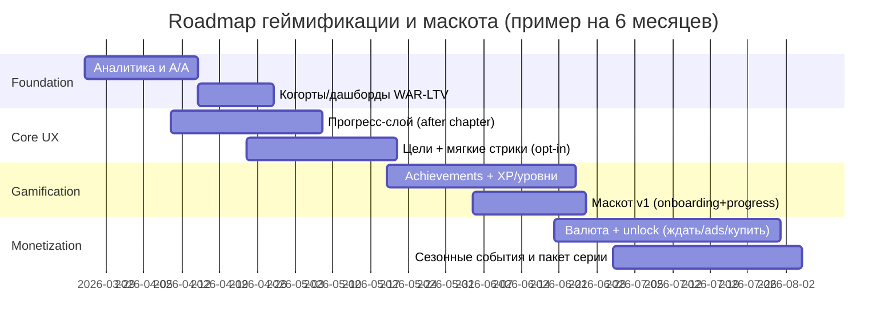

# Геймификация приложения для чтения книг и комиксов с маскотом

## Executive summary

**Контекст и допущения.** Так как платформа, бюджет и сроки не заданы, ниже я исхожу из «среднего» сценария: продукт доступен на мобильных устройствах (и, возможно, web), есть аккаунты/синхронизация прогресса, библиотека, покупки (разовые/подписка) и бесплатный контент. Эти предположения важны, потому что некоторые механики (валюта, задания, сезонность, социальность) требуют аккаунта и устойчивой аналитики. Определение «геймификации» в отчёте — «использование элементов игрового дизайна в неигровом контексте» (Deterding et al., 2011). citeturn12search0

**Стратегия “не ломать чтение”.** В чтении главный риск — разрушить погружение. Поэтому базовый принцип: игровые элементы должны быть **“слоем вокруг чтения”**, а не “поверх чтения”: максимум сигналов и наград — **после естественных чекпоинтов** (конец главы/эпизода, закрытие книги/тома, выход из ридера), а не всплывающими окнами в процессе. Такой подход согласуется с тем, что часть внешних наград может снижать внутреннюю мотивацию при определённых условиях (особенно ожидаемые и «контингентные» награды за само действие), поэтому важно избегать “чтения ради монет/XP”. citeturn12search2

**Что реально “держит” пользователей в чтении (и почему).** По бенчмаркам лидеров видно, что устойчивые драйверы удержания — это (а) **цели и прогресс** (Goodreads Reading Challenge и achievements‑«закладки», Kindle Reading Insights/Challenges), (б) **ритуалы возвращения** (стрики, еженедельные события вроде Tapas Fortune Cookie), (в) **экономика эпизодов** для сериалов (WEBTOON Coins/Fast Pass/Ad Pass, Tapas Ink). citeturn19search1turn19search5turn20search3turn0search3turn18search0turn17view0turn0search6

**Северная звезда (North Star metric) для геймификации.** Рекомендуемая NSM:  
**Weekly Active Readers (WAR) с осмысленным чтением** = число/доля пользователей, которые за неделю читают ≥ *N* минут **и** завершают ≥ *K* «естественных» единиц прогресса (глава/эпизод/часть тома). Это защищает от «накруток» (пролистывание ради поощрений) и связывает рост вовлечения с ростом потребления контента.

**Приоритетный пакет для первых итераций (наиболее “безопасный” для UX).**
1) **Прогресс‑слой**: прогресс‑бар, экран “после главы/эпизода”, статистика чтения (вне ридера).  
2) **Цели и мягкие стрики** (opt‑in): ежедневная цель (минуты/главы), календарь, “grace day”.  
3) **Достижения‑коллекции** (в профиле): “закладки/бейджи”, привязанные к чтению и discovery (как у Goodreads). citeturn19search5turn0search1turn20search3  

**Монетизация без ухудшения UX:**  
— Для комиксов/серий: модель «ранний доступ/разблокировка эпизодов» (аналог Fast Pass/Coins) плюс «бесплатный путь» (Ad Pass/таймер) с частотными ограничениями и прозрачностью условий. citeturn0search6turn17view0turn16view0  
— Для книг: подписка с ценностью «комфорт и каталог» (офлайн, без рекламы, расширенная статистика/перки), как логика Kindle Unlimited (borrow‑модель и доступ на разных устройствах). citeturn10search2  
— Платформенный комплаенс: цифровые товары/валюты/подписки на Android должны использовать Google Play Billing (если распространяетесь через Google Play), аналогично на iOS — In‑App Purchase. citeturn13search3turn13search2

**Почему нужен постепенный rollout и A/B.** Эмпирические обзоры подчёркивают, что “gamification работает не всегда и не одинаково”, эффект зависит от контекста и аудитории, а в ряде случаев проявляется “novelty effect” (быстрый всплеск → снижение). Поэтому внедрение должно быть итеративным, с A/B, guardrails и ясными метриками успеха. citeturn12search1turn21search0

## Аудитория и сценарии

**Аудитория широкая → сегментация по мотивации важнее возраста.** Для подростков и взрослых реакция на геймификацию различается прежде всего мотивацией: кому‑то нужны цели и ритуалы, кому‑то — коллекционирование и сериальность, а часть аудитории “анти‑геймификация” и хочет «тихий ридер». Это напрямую влияет на дизайн: “соревнование по умолчанию” почти всегда токсично; оптимальнее — *opt‑in* и тонкие механики прогресса. (Практический сигнал: даже в Goodreads заметна чувствительность к изменениям социальных частей челленджа — пользователи воспринимают «видимость прогресса друзей» как ценность.) citeturn19search1turn19search10

**Практичные сегменты (для продуктовой настройки механик).**
- **“Привычка и дисциплина”**: ценят цели, календарь, стрики, “план недели”. Kindle Reading Insights/Challenges и формулировки Amazon Staff про стрики/челленджи показывают, что Amazon считает этот слой отдельной ценностью (“Reading Insights/Challenge”). citeturn20search3turn10search7  
- **“Сериальные комикс‑читатели”**: поведение эпизодное, сильна ценность “читать раньше/сейчас”, поэтому органично работают Coins/Fast Pass/Ad Pass и Daily Pass‑логика. citeturn0search6turn17view0  
- **“Коллекционеры и completionists”**: любят закрывать серии и собирать достижения. Goodreads прямо оформляет achievements как коллекционные «закладки» и связывает их с discovery (curated lists). citeturn0search1turn19search5  
- **“Социальные читатели”**: читают ради обсуждения/клубов и «социального доказательства». Русские аналоги подтверждают спрос: LiveLib строит годовой “Книжный вызов” с виджетом темпа и социальной массовостью. citeturn1search2turn1search17  
- **“Бюджет‑ориентированные”**: готовы смотреть рекламу/выполнять задания ради доступа (Tapas Free Ink offers; WEBTOON Treasure Hunt). Но это зона повышенных UX‑ и этических рисков, особенно при смешанной возрастной аудитории. citeturn18search2turn16view0  
- **“Тихие читатели” (анти‑геймификация)**: для них геймификацию нужно прятать в профиль/хаб и делать отключаемой.

**Ключевые пользовательские сценарии.** Для продукта “книги + комиксы” полезно считать двумя «двигателями»: (1) длинная форма (книги), (2) эпизодная форма (комиксы/вебтуны). Это определяет best‑practice монетизации: “валюта/разблокировки” чаще органичны в эпизодах. citeturn17view0turn18search0  

**Mermaid flowchart пользовательских сценариев с точками геймификации (встроено без разрыва чтения):**

```mermaid
flowchart TD
  A[Открытие приложения] --> B{Есть незавершённое чтение?}
  B -- Да --> C[Продолжить с последнего места]
  B -- Нет --> D[Поиск/рекомендации/подборки]
  D --> E[Страница тайтла: превью/описание/серия]
  E --> F{Доступность контента}
  F -- Бесплатно/куплено --> G[Чтение]
  F -- Частично закрыто --> H{Выбор пути доступа}
  H --> H1[Подождать/таймер (например Daily/Free pass)]
  H --> H2[Реклама за эпизод (Ad Pass)]
  H --> H3[Валюта (Coins/Ink)]
  H --> H4[Подписка/пакет серии]
  G --> I{Естественный чекпоинт?}
  I -- Да --> J[Экран "после главы": прогресс, XP/бейдж (тихо), "что дальше?"]
  I -- Нет --> G
  J --> K{Хочет соц/оценку?}
  K -- Да --> L[Оценить/коммент/поделиться/в полку]
  K -- Нет --> M[Мягкие рекомендации + план/цель (opt-in)]
  L --> M
  M --> N[Выход] --> O[Уведомления только по подписке]
```

## Бенчмарк и уроки рынка

Ниже — механики, которые **доказали жизнеспособность** в массовых читательских продуктах, и уроки для вашего дизайна.

**Goodreads: цели + достижения как “коллекционные закладки” + discovery.**  
- Goodreads описывает reading challenges как способ «трекать и праздновать чтение», включая годовые цели, сезонные челленджи и сбор achievements; также упоминает просмотр прогресса друзей. citeturn19search1turn0search12  
- Achievements представлены как “закладки” и, по описанию Goodreads, помогают достигать годовой цели и открывать новые книги; часть достижений можно заработать, читая книги из curated list. Это сильный паттерн: **achievement → curated list → discovery → новые старты чтения.** citeturn0search1turn19search5  
- Goodreads также подробно объясняет, “как убедиться, что книга засчиталась”, и затрагивает приватность/видимость Kindle‑книг в профиле (не все Kindle‑книги автоматически видны друзьям). Это важный сигнал: **геймификация = данные + правила учёта + приватность.** citeturn19search0  

**WEBTOON: валюта и разные пути доступа (платно/реклама/ожидание) + ежедневные лимиты.**  
- WEBTOON описывает Coins как валюту, которой разблокируют Fast Pass (ранний доступ) и эпизоды (в т.ч. Daily Pass‑серии). Daily Pass: 1 бесплатный эпизод в день, доступен 14 дней; за Coins — доступ сохраняется, пока серия в сервисе. Это готовый “конструктор” для вашего эпизодного контента: бесплатный прогресс с ограничением + платный “снять ограничения”. citeturn17view0  
- Treasure Hunt — пример “earn loop”: квесты → Free Coins. Важно: WEBTOON прямо ограничивает участие (США) и ставит возраст 13+; также заявляет, что Coins, заработанные в квестах и потраченные на ORIGINALs, учитываются как “paid Coins” для целей дохода создателей. Это полезно как модель: **rewarded currency может монетизировать контент без прямой оплаты пользователем**, но требует возрастных/региональных ограничений и аккуратной этики. citeturn16view0  
- Free Coins у WEBTOON имеют срок действия и отдельный учёт (My Coins показывает expiry), Free Coins тратятся первыми. Это урок по UX экономики: **прозрачность срока и порядка списания снижает фрустрацию.** citeturn17view0  

**Tapas: валюта Ink + “еженедельный ритуал” + события для discovery.**  
- Tapas описывает Ink как валюту для разблокировки эпизодов и поддержки создателей; её можно купить или получить через offers (если доступны). citeturn18search0  
- Fortune Cookie — еженедельная кампания: по понедельникам пользователь получает “печеньку”, которую нужно открыть в течение 24 часов, чтобы получить случайное количество Bonus Ink. Это сильный ретеншн‑паттерн «weekly ritual», но потенциально FOMO‑чувствительный. citeturn0search3turn0search7  
- Tapas прямо предупреждает, что Bonus Ink истекает; срок виден в сообщении/деталях подарка. Это важный урок: **если даёте “бонусную” валюту — обязательно объясняйте срок и показывайте его явно.** citeturn18search3  
- Tapas events описаны как способ discovery и заработка Ink; часть событий сезонные. citeturn18search1  

**Kindle: стрики и “Reading Insights/Challenges” как привычка‑продукт.**  
- Amazon Staff на форуме описывает Kindle Challenge как программу достижений (digital badges) по чтению, а доступ к ней — через “More → Reading Insights → Kindle Challenge”; также отмечает, что чтение должно синхронизироваться (Wi‑Fi/моб.данные) для учёта достижений. Даже если это не “официальный help‑центр”, это крайне близко к первоисточнику, т.к. отвечает Amazon Staff. citeturn20search3turn20search16  
- В других ответах Amazon Staff/модераторов описывается, что Reading Insights показывает дни чтения, weekly/daily streak и календарь активности. Этот слой особенно важен для “тихих читателей”: он даёт мотивацию без социальной конкуренции. citeturn10search7turn20search12  

**Русские аналоги: цели/статистика + соревнование (opt‑in) + челленджи с призами.**  
- Яндекс Книги: “Достижения” определяются как статистика чтения; там же предлагается ставить годовые цели и соревноваться с друзьями через опцию “Обещание”. Это прямой референс для вашего social‑слоя: цели как “обещание”, но только по желанию. citeturn1search0  
- LiveLib: годовой “Книжный вызов” предлагает выбрать цель по числу книг и показывает темп (“сколько книг в месяц для успеха”), обещает график и рекомендации; подчёркивает масштаб участия. Это демонстрация, что “годовая цель + темп + виджет” — понятный массовый формат. citeturn1search2turn1search17  
- MyBook: примеры челленджей показывают механику “прочитай X книг за период → участие в розыгрыше/призы/бонусы”, включая доступ к части книг бесплатно и требования “подключиться к интернету в день завершения, чтобы статистика засчиталась”. Это полезно как референс UX‑правил учёта и партнёрской монетизации челленджей. citeturn24view0turn24view1  

**Сводка эффективности (качественная, с указанием силы доказательств).**  
- **Цели/прогресс/статистика (вне ридера)**: высокая эффективность и низкий риск для UX (много первоисточников у Goodreads/Kindle/русских сервисов). citeturn19search1turn10search7turn1search0turn1search2  
- **Стрики**: часто сильный ретеншн‑рычаг, но требуют “мягкого дизайна” из‑за эффекта “сломанных стриков”. Исследования в consumer‑поведении показывают, что “подсвеченные intact streaks” увеличивают последующее вовлечение по сравнению с подсвеченными broken streaks. citeturn15search8  
- **Валюта/разблокировки (эпизоды)**: высокая монетизационная мощность, но повышенные UX/этические риски и требование прозрачной экономики (expiration, порядок списания). В бенчмарках WEBTOON/Tapas это прямо отражено в help‑материалах. citeturn17view0turn18search3  
- **Earn‑квесты/офферы**: потенциально сильны на DAU, но самый рискованный слой (качество трафика, возрастные ограничения, доверие). WEBTOON явно вводит 13+ и ограничивает географию Treasure Hunt. citeturn16view0  

## Предлагаемые механики и UX‑паттерны

Ниже — набор механик, покрывающий ваш список, с целями, KPI, рисками и примерами интерфейсных паттернов. Приоритет — продуктовый (что обычно даёт максимальный эффект при минимальном риске “сломать чтение”), а не технический.

**Легенда целей:** E = вовлечённость, R = удержание, M = монетизация.  
**Общий guardrail для всех механик:** не ухудшать *Time‑to‑Read* (время от открытия приложения до начала чтения), не увеличивать количество прерываний чтения, не снижать рейтинг/NPS.

### Таблица механик

| Механика | Описание реализации (конкретно) | Цель | KPI/метрики | Риски/побочные эффекты | Приоритет | Пример UI/UX паттерна |
|---|---|---|---|---|---|---|
| Баллы (XP) за чтение | XP начислять только за “осмысленные” события: `chapter/episode_complete`, чтение ≥ X минут, `title_complete`; лимиты на сутки; анти‑фрод по скорости перелистывания | E, R | WAR, chapters/episodes per user/week, средняя длина серии чтений, % пользователей с прогрессом XP | “Прокрутка ради XP”, смещение мотивации во внешнюю (Deci meta‑analysis как риск). citeturn12search2 | Высокий | Тихий тост “+12 XP” **после главы**, без поп‑апа в ридере |
| Уровни | Уровни “читателя” как оболочка над XP; награды — косметика/удобство (темы, аватары), не pay‑to‑win | R, (M через косметику) | доля пользователей, достигших уровня N; повторные визиты; CVR в косметику | нужда в контенте для наград; “инфляция уровней” | Средний | “Профиль → уровень + прогресс‑полоса”; кнопка “что даёт уровень” |
| Достижения (бейджи) | Коллекционные достижения в стиле “закладки” как у Goodreads; часть достижений — “прочитай из curated list” (discovery‑триггер) citeturn0search1turn19search5 | E, R | achievement completion rate, uplift в начатых тайтлах из подборок, share rate | “чтение ради бейджа”; девальвация при слишком частой выдаче | Высокий | “Витрина достижений” в профиле + “прогресс к достижению” на экране после главы |
| Годовой/месячный челлендж | Пользователь ставит цель (книги/эпизоды/минуты). Важно: можно редактировать/удалять цель (как у Goodreads). citeturn19search15turn0search0 | R | D30/D90 retention, completion rate цели, доля “активных читателей” | стресс от нереалистичной цели; давление | Высокий | Карточка “Моя цель: 20 книг” в профиле; темп/прогноз “нужно 2 книги/мес” (паттерн LiveLib). citeturn1search2 |
| Ежедневные задания | 1–3 простых миссии/день (прочитай 10 минут; заверши эпизод; открой новый жанр). Можно пропустить без штрафа | R, E | task uptake, возвращаемость на следующий день, “fatigue” (view without complete) | превращает чтение в чек‑лист; раздражение | Средний | Сворачиваемый блок “Сегодня” на Home; отдельный “центр заданий” вне ридера |
| Еженедельные задания/план | План недели (“3 сессии по 20 минут”) + weekly recap; можно выбрать режим | R | WAU/MAU, доля недель с ≥3 сессиями, средние минуты/неделю | перформативное давление | Высокий | “План недели” + “итоги недели” в воскресенье (без пушей по умолчанию) |
| Стрик чтения (мягкий) | Стрик по дням, но с “grace day/восстановлением” и без обвиняющего тона; подсветка intact streak, осторожно с broken streak | R | median streak length, D7/D30 retention, push opt‑in, churn после срыва стрика | “стрик‑тревожность”; уход после срыва; исследования показывают влияние того, как отражён broken streak. citeturn15search8 | Высокий | Календарь активностей (как Reading Insights) + кнопка “пауза/выходные” (opt‑in) citeturn10search7 |
| Прогресс‑лента/таймлайн (личный) | Личный таймлайн “что я прочитал/закрыл” без соц‑давления | E, R | повторные просмотры профиля, completion rate, возврат к незавершённым | умеренная ценность без дополнительного слоя | Средний | “Профиль → история чтения” + фильтры жанров |
| Социальные функции | Друзья/подписки, совместные челленджи. Референс: Яндекс Книги предлагает соревноваться через “Обещание”. citeturn1search0 | R | invites, K‑factor, social DAU, участие в совместных целях | токсичность сравнения, приватность | Средний | “Совместная цель” только после явного выбора “пригласить друга” |
| Социальная лента | Лента действий друзей (прочитал, получил достижение, отзыв). По умолчанию — приватная активность; granular controls | R | feed MAU, взаимодействия, удержание соц‑ядра | модерация/спам; privacy‑инциденты | Средний/Низкий | Отдельная вкладка “Сообщество”; настройки “что публиковать” |
| Коллекционирование | Коллекции серий (тома/арки), тематические “полки”, коллекционные карточки персонажей (для комиксов) | E | series completion, add‑to‑library, repeat visits to collections | UI‑перегруз, “фетиш коллекций” | Средний | На странице серии: “Собрано 7/12 томов” + кнопка “продолжить” |
| Персональные рекомендации‑квесты | Рекомендации “почему это вам” + мини‑миссии discovery (прочитай 1 книгу из подборки → достижение). Паттерн: Goodreads achievements через curated lists. citeturn0search1turn19search5 | E, R, M | CTR recs, new title starts, uplift в покупках из подборок | недоверие к алгоритму; “навязывание” | Высокий | Блок “Жанр недели” + кнопка “почему рекомендовано” |
| Сезонные события | “сезоны” 4–6 недель: тематические достижения, подборки, косметика/купоны. Опирайтесь на “fresh start effect” (новая неделя/месяц/год мотивируют). citeturn15search3 | R, E, (M) | участие в ивенте, uplift WAU, reactivation | FOMO, усталость | Средний | Вкладка “Сезон” с таймером, но без агрессивных push; “присоединиться” по кнопке |
| Внутренняя валюта | Валюта для эпизодов/раннего доступа/пакетов; прозрачные цены; отдельный “кошелёк” с историей | M, R | IAP CVR, ARPPU, частота трат | сложность экономики, обвинения в манипуляции | Средний | “Кошелёк”: баланс, что можно купить, история; на эпизоде — чёткая цена |
| Альтернативные пути доступа (ads/таймер) | “Ad Pass/Rewarded ads/таймер” как бесплатный путь; строгое ограничение частоты | M (ads), R | ad‑ARPDAU, % unlock via ads, retention среди free | ухудшение UX; раздражение рекламой | Средний | На закрытом эпизоде: 3 кнопки — “подождать”, “реклама”, “купить” (без скрытых приоритетов) |
| “Daily pass” для архивных серий | Для завершённых серий: 1 бесплатный эпизод/день с ограничением по времени доступа (референс WEBTOON: 14 дней), платный permanent unlock | R, M | возврат по дням, spend на binge | “искусственное ограничение” вызывает негатив | Средний | На списке эпизодов: метки “free today” и “unlock”, с объяснением сроков citeturn17view0 |
| Микротранзакции | Пакеты валюты, пакет серии, “ранний доступ”, косметика, “без рекламы”. На Android — Play Billing для цифровых товаров/валют. citeturn13search3turn13search7 | M | ARPU/ARPPU, conversion, refund rate | риск “dark patterns” при агрессивных paywall | Средний | Магазин с понятными пакетами; paywall только при попытке открыть premium |
| Подписка | Премиум: без рекламы, каталог, офлайн, расширенная статистика, перки. Референс подписочной ценности: Kindle Unlimited (“borrow up to 20 titles”). citeturn10search2 | M, R | trial→paid, churn, LTV | претензии к прозрачности условий | Высокий | Экран подписки “что входит” + управление подпиской; избегать “maze of screens” (FTC). citeturn13search0 |
| Интеграция с офлайн‑ивентами | QR‑бейджи на фестивалях/библиотеках/книжных: “ивент‑достижение”, купоны на пакет серии | R, M | QR activations, partner conversions | операционные затраты, фрод | Низкий/Средний | “Сканировать QR → получить бейдж”; отдельная страница “ивент” |

**ASCII‑паттерн “Экран после главы/эпизода” — главный “хаб геймификации без разрыва чтения”:**

```text
┌──────────────────────────────────────┐
│ Глава завершена ✅                    │
│ Прогресс книги: 37%  ████▌           │
│                                      │
│ Сегодня: 8/20 мин  •  Стрик: 4 дня 🔥 │
│ +12 XP  •  Бейдж почти готов: 2/3     │
│                                      │
│ [Продолжить]   [Сохранить]           │
│ [Короткий отзыв]  [Поделиться]       │
└──────────────────────────────────────┘
```

## Маскот и персонажная система

Цель маскота в вашем продукте — не “мимими‑декор”, а **снижение трения и повышение эмоциональной связности**: объяснить механику, сопровождать onboarding, “озвучивать” награды и события, быть узнаваемым в пуш‑уведомлениях и маркетинге.

### Референсы маскотов и персонажей в книжных/комикс‑продуктах

**Проблема рынка:** у классических “тихих” ридеров (Goodreads/Kindle как чтение, не игра) маскот редко является центральным элементом интерфейса; чаще там минимализм. Поэтому релевантные референсы находятся в **смежных** продуктах (трекеры привычки чтения) и в **комикс‑экосистемах**, где тон более игривый.

- **Bookly (reading tracker):** “Bloo” — маскот/ассистент; в блоге Bookly говорится, что вкладка Assistant открывается через иконку Bloo, где он “приветствует” и показывает уровень/цели/отчёты. Это сильный паттерн: **маскот = вход в центр прогресса**, не мешая чтению. citeturn3search2turn2search3  
- **Bookly расширяет маскота в отдельный простейший спин‑офф “Bloo Jump” (мини‑игра) — App Store описывает Bloo как маскота Bookly.** Это демонстрация, что маскот может жить и вне основного приложения (мерч/игра/стикеры) без давления на core UX чтения. citeturn3search5  
- **Tapas:** в Newsfeed Tapas есть упоминание, что у сообщества Tapastry есть маскот Pupper (созданный участниками). Это пример “community mascot” — мягкий, дружелюбный, не обязательно “детский”. citeturn3search1  
- **WEBTOON:** внутри серии WEBTOON GREENLiGHT присутствует персонаж Wiggle (в тексте эпизода упоминается “Wiggle is wrangled by …”), а сама серия использовала лайки как “голосование” (60k likes → greenlit). Это показывает два урока: (1) персонаж‑ведущий может быть частью игровых активаций, (2) геймификация может быть встроена в сами правила продвижения контента. citeturn9view0turn5view0  
- **Русскоязычные материалы по роли маскота в приложении (как практика):** Heads and Hands описывает, что маскот может помогать пользователю в ошибках/подсказках, вызывать эмоции и быть системным элементом. Это полезно как дизайн‑референс для “помощник, когда что‑то пошло не так”. citeturn2search2  
- **Определение и роль маскота как бренд‑персонажа** (не путать с логотипом) хорошо сформулированы в русскоязычном материале “Палиндром”. citeturn14search10  

### Желаемые эмоции/характер для книжно‑комикс приложения

Для широкой аудитории (подростки+взрослые) безопаснее всего набор эмоций:  
**“тепло + любопытство + уважение к автономии”** (маскот не должен “командовать” и “стыдить” за пропуски). Это напрямую связано с риском подрыва внутренней мотивации внешними стимулами: маскот‑надзиратель усиливает “давление”, маскот‑компаньон поддерживает выбор. citeturn12search2  

Практическая дизайн‑формула:  
**маскот = “проводник” в прогресс/награды/экономику**, но не “надзиратель” за чтением.

### Шесть концептов маскота

Ниже — 6 концептов, сконструированных так, чтобы покрыть разные роли (onboarding, подсказки, награды, пуши, мерч) и разные “тона” (более серьёзный/более игривый). Каждый концепт можно реализовать сначала как **статичный персонаж‑иконка + набор эмоций (3–5 выражений)**, а анимацию добавить позже.

#### Таблица сравнения концептов

Оценки качественные (H/M/L) и ориентированы на “влияние × риск × стоимость внедрения”.

| Концепт | Роль (primary) | Ожидаемый uplift | Риски | Приоритет |
|---|---|---|---|---|
| Лис‑Библиотекарь | onboarding + подсказки | Engagement: M, Retention: M | “слишком детский” для части взрослых | Высокий |
| Моль‑Куратор (как “Wiggle‑паттерн”) | события/голосования/подборки | Engagement: M, Discovery: H | ассоциации с “молью”/одеждой; нужен правильный арт | Средний |
| Дух‑Закладка | награды/достижения | Engagement: M, Share: M | может выглядеть мистически (не всем) | Высокий |
| Кот‑Серийщик | push‑уведомления + сериальные эпизоды | Retention: H | риск раздражения из‑за push‑коммуникаций | Средний |
| Дрон‑Сканер “Комикс‑Разведчик” | помощь в discovery/рекомендациях | Discovery: H | техно‑эстетика может конфликтовать с “книжностью” | Низкий/Средний |
| Пёс‑Компаньон “Паппер‑типаж” | комьюнити/социалка | Social: M, Retention: M | риск “инфантильности”; нужен сдержанный стиль | Средний |

#### Концепт Лис‑Библиотекарь “Фокс”

**Название:** Фокс  
**Кратко:** лис в очках и с мини‑свитком‑списком; архетип “умный проводник”, не морализатор.  
**Целевая роль:** onboarding, подсказки по поиску/полкам/закладкам, объяснение “как работает цель/стрик”.  
**Использование:**  
— статично: иллюстрации в onboarding и пустых состояниях (“у вас пока нет полок”);  
— анимировано: микро‑анимация “подмигнул” на экране после главы (0.5–1с).  
**UI‑паттерн:** иконка/аватар Фокса в “Центре прогресса”, как у Bookly Bloo‑иконки, ведущей к Assistant‑разделу. citeturn3search2  
**KPI:** completion onboarding, opt‑in на персонализацию/цели, снижение ошибок/FAQ‑просмотров; uplift WAR.  
**Риски/этика:** не использовать “стыдящие” реплики за пропуск; не применять к детям агрессивные призывы.  
**Приоритет:** высокий (низкий риск, высокий UX‑профит).

ASCII‑скетч:

```text
 /\_/\ 
( o.o )  ← очки
 > ^ <   + маленькая "закладка" в лапе
```

#### Концепт Моль‑Куратор “Люмен”

**Название:** Люмен  
**Кратко:** стильная “моль света” (но визуально скорее мотылёк), живёт вокруг лампы/подсветки страницы. Референс: у WEBTOON GREENLiGHT есть персонаж Wiggle и механика “лайками выбираете следующее”. citeturn9view0turn5view0  
**Роль:** сезонные события, “подборка недели”, голосования за подборки/обложки, “осветить” редкие жанры.  
**Использование:**  
— статично: обложка‑бейдж сезона;  
— анимировано: “подлетел к лампе” при старте сезонного события.  
**UI‑паттерн:** вкладка “Сезон” + карточка “Люмен рекомендует: 5 редких жемчужин”.  
**KPI:** CTR подборок, new title starts, участие в событиях, share подборок.  
**Риски:** слово “моль” может иметь отрицательную коннотацию; нужно нейминг‑тестирование и арт, который считывается как “мотылёк/свет”.  
**Приоритет:** средний.

ASCII‑скетч:

```text
  \|/
 --*--   ← лампа
  /|\
 (• •)   ← мотылёк рядом
 /___\
```

#### Концепт Дух‑Закладка “Маркер”

**Название:** Маркер  
**Кратко:** мини‑призрак‑закладка (как лента/закладка с глазками), “живёт” в уголке страницы, но появляется только после главы.  
**Роль:** награды, достижения, “collectibles” и “мягкая магия прогресса”.  
**Использование:**  
— статично: “закладка‑бейдж” (сильный референс: Goodreads achievements оформлены как закладки). citeturn0search1turn19search5  
— анимировано: “вылетел бейдж‑закладка” на экране после главы.  
**UI‑паттерн:** коллекция “закладок” в профиле; при получении — карточка без блокировки чтения.  
**KPI:** achievement engagement, share rate (скрин “получил закладку”), рост completion.  
**Риски:** мистическая эстетика может не всем зайти; делать нейтрально (минимализм).  
**Приоритет:** высокий.

ASCII‑скетч:

```text
  ______
 |  👀  |  ← закладка
 |______|
    ||
    ||
```

#### Концепт Кот‑Серийщик “Мяу‑Редактор”

**Название:** Мяу‑Редактор  
**Кратко:** кот‑редактор, который “приносит новые эпизоды”.  
**Роль:** мягкий триггер возвращения (уведомления о новых главах/эпизодах, напоминания о незаконченной серии).  
**Использование:**  
— статично: аватар в пушах и Inbox‑сообщениях;  
— анимировано: “кот принёс новую главу” в центре уведомлений.  
**UI‑паттерн:** “Инбокс” с сообщениями от кота (как системные сообщения), настройка частоты.  
**KPI:** open rate пушей, return rate, episode completion.  
**Риски/этика:** пуши легко превращаются в давление; обязателен opt‑in и частотные лимиты; избегать FOMO‑манипуляций (FTC/OECD о тёмных паттернах — важный ориентир). citeturn13search0turn13search1  
**Приоритет:** средний.

ASCII‑скетч:

```text
 /\_/\ 
( -.- )  ← спокойный кот
 >📩<    ← письмо/новый эпизод
```

#### Концепт Дрон‑Сканер “Панель”

**Название:** Панель  
**Кратко:** маленький дрон‑сканер, который “раскладывает комикс по панелям”.  
**Роль:** объяснять “режимы чтения комикса”: панели/кадры, масштаб, офлайн.  
**Референс:** Kindle/KDP описывает Guided View как “cinematic reading experience” panel‑to‑panel, удобный на телефонах; пользователи могут входить/выходить и настраивать. citeturn11search1turn11search13  
**Использование:**  
— статично: подсказки “включите Guided/Panel view”;  
— анимировано: “рамка панелей” поверх превью на 0.5с (не в чтении).  
**UI‑паттерн:** подсказка на первом комиксе: “Панель подскажет режим чтения”.  
**KPI:** adoption panel view, снижение отказов на комиксах, рост времени чтения комиксов.  
**Риски:** техно‑стиль может конфликтовать с “книжной” частью; использовать только в комикс‑контуре.  
**Приоритет:** низкий/средний.

ASCII‑скетч:

```text
 [o]───┐
  |    │  ← дрон + рамка
 / \  [#]
```

#### Концепт Пёс‑Компаньон “Паппер”

**Название:** Паппер  
**Кратко:** тёплый собакен‑спутник, “сообщество и поддержка”. Референс: Tapas называет Pupper маскотом Tapastry. citeturn3search1  
**Роль:** социалка, клубы, совместные челленджи; “подбодрить” без давления.  
**Использование:**  
— статично: “вступить в клуб”, “пригласить друга”;  
— анимировано: реакции “лайк/аплодисменты” на отзыв.  
**UI‑паттерн:** раздел “Клубы” с Паппером как ведущим.  
**KPI:** участие в клубах, invite rate, retention среди social‑ядра.  
**Риски:** взрослые могут счесть слишком детским; решается стилем (минимализм, без “пупс‑лиц”).  
**Приоритет:** средний.

ASCII‑скетч:

```text
 / \__
(    @\___
 /         O
/   (_____/
/_____/ U
```

### A/B тесты и метрики влияния маскота

**Почему A/B обязателен:** маскот может как снижать трение, так и раздражать “тихих читателей”. Поэтому тестируйте с сегментацией на “любителей прогресса” vs “минимализм”.

**Рекомендуемые эксперименты:**
- **Onboarding:**  
  Variant A: onboarding‑подсказки текстом; Variant B: те же подсказки от маскота (без дополнительного контента).  
  Primary: onboarding completion, “start first reading session”, opt‑in на цель/персонализацию. Guardrails: early churn, негативные отзывы.  
- **Центр прогресса:**  
  A: статистика/достижения без маскота; B: вход в раздел через иконку маскота (Bookly‑паттерн Bloo). citeturn3search2  
  Primary: visits to progress hub, goal adoption, D7 retention.  
- **Награды:**  
  A: бейдж‑тост обычный; B: бейдж “вручает” маскот (анимация ≤1с на экране после главы).  
  Primary: achievement engagement, share rate. Guardrails: time‑to‑next‑chapter.  
- **Пуш‑тон:**  
  A: нейтральные уведомления; B: от маскота.  
  Primary: open rate, return within 24h. Guardrails: opt‑out rate, uninstall after push.

## Дорожная карта, A/B тесты и аналитика

### Дорожная карта внедрения (с трудозатратами)

| Этап | Что выпускаем | Effort | Основные A/B | Метрики успеха | Guardrails |
|---|---|---|---|---|---|
| Аналитический фундамент | Event‑таксономия чтения, прогресса, покупок; когорты (D1/D7/D30), WAR | High | A/A на качество данных | match rate событий, стабильность | crash rate, battery, latency |
| Прогресс‑слой | Экран “после главы/эпизода”, прогресс‑бар, статистика | Medium | “после главы” (варианты плотности) | рост completion, WAR | time‑to‑read, NPS |
| Цели и стрики (opt‑in) | daily goal, календарь, мягкий стрик, weekly plan | Medium | minutes vs chapters; grace vs none | D7/D30 retention, streak adoption | тревожные сигналы, churn после срыва |
| Достижения + XP/уровни | achievements‑“закладки”, XP, уровни, базовые коллекции | Medium/High | какие действия дают XP; частота бейджей | growth in engagement без накруток | “fast scrolling”, support tickets |
| Валюта и эпизодная экономика | Coins/Ink‑аналог, unlock пути (ждать/ads/купить), пакеты серии | High | price packs, ad caps | ARPDAU, ARPPU, LTV | refund rate, жалобы |
| Маскот v1 | статичный набор эмоций + роли: onboarding/прогресс/награды | Low/Medium | mascot vs no mascot | onboarding completion, goal opt‑in | негативные отзывы, отключения |
| Сезоны/ивенты + социалка | сезонные челленджи, клубы, совместные цели | High | event vs no‑event; social opt‑in | uplift WAU, invites | модерация, токсичность |

### Mermaid Gantt для roadmap



### План аналитики и метрик (что измерять)

**Событийная модель (минимум).**  
Чтение: `content_open`, `reading_start`, `reading_heartbeat`, `reading_end`, `chapter/episode_complete`, `title_complete`.  
Геймификация: `goal_set`, `streak_increment`, `achievement_unlocked`, `xp_awarded`, `event_join`, `reward_claim`.  
Монетизация: `paywall_view`, `purchase_start/success`, `coins_spend`, `unlock_via_ad`, `subscription_start/cancel`.

**Когортный анализ.**  
- Когорты по первому чтению (first_read), по первому завершению главы, по первому unlock (если есть), по первой покупке/подписке.  
- Ретеншн D1/D7/D30, rolling retention, WAU/MAU, DAU/MAU.  

**Монетизация.**  
ARPU/ARPPU/ARPDAU, конверсия в покупку, LTV по когортам, churn подписки, refund rate.

**Специально для стриков (важно из‑за поведенческих эффектов).**  
Исследования показывают, что “подсветка intact vs broken streak” меняет последующее вовлечение, поэтому аналитика должна отслеживать “срыв стрика → вероятность ухода” и эффект “grace day”. citeturn15search8  

**Сезонность и “fresh start”.**  
Сезонные события лучше стартуют на “темпоральных рубежах” (новая неделя/месяц/год), что согласуется с эффектом “fresh start” (Dai, Milkman, Riis). Это можно использовать для календаря ивентов и ре‑активации. citeturn15search3  

## Этика, доступность, возраст и комплаенс, источники

### Этика и UX: как избежать манипуляций и “игры вместо чтения”

**Анти‑dark patterns как дизайн‑ограничение.** FTC описывает “dark patterns” как практики, которые могут “подрывать автономию” и включают, например, “maze of screens” для отмены подписки, скрытие полной стоимости или “sneaking” товаров в корзину. Для ваших подписок/валюты это означает: ясная цена, ясные условия, лёгкая отмена, отсутствие скрытых приоритетов кнопок. citeturn13search0  
OECD аналогично трактует “dark commercial patterns” и документирует их распространённость/вред. citeturn13search1  

**Риск подрыва внутренней мотивации.** Мета‑анализ Deci, Koestner, Ryan (128 исследований) показывает, что ожидаемые и “контингентные” награды могут снижать свободно выбранную внутреннюю мотивацию (free‑choice) и интерес. Практический вывод: не платить монетами/XP просто “за факт чтения” без ограничений; лучше награждать за смысловые вехи и делать награды “информационными” (прогресс/компетентность), а не “контролирующими”. citeturn12search2  

**Новизна и усталость.** Лонгитюдные работы фиксируют, что эффект геймификации может снижаться со временем (“novelty effect”) и требует продуманного обновления механик/нарратива, а не бесконечного добавления бейджей. citeturn21search0turn12search1  

### Доступность

WCAG 2.2 является рекомендацией W3C и добавляет новые требования (например, target size, dragging movements, focus not obscured и др.). Даже если вы не “web”, это хороший ориентир для мобильного UI (размеры целей, предсказуемость, доступная аутентификация, снижение когнитивной нагрузки). citeturn12search3turn12search7  

### Возрастные ограничения и чувствительные механики

Если продукт рассчитан на подростков, особенно осторожно с “earn walls” и рекламными квестами. Пример: WEBTOON Treasure Hunt требует 13+ и ограничен географией; это демонстрирует, что даже крупные платформы вынуждены вводить возрастные и региональные ограничения для подобных механик. citeturn16view0  

### Комплаенс платежей и платформ

- Google Play: политика платежей прямо перечисляет цифровые товары/виртуальные валюты/подписки как категории, которые (если не предусмотрено исключение) требуют использования Google Play Billing. citeturn13search3turn13search7  
- Apple HIG: in‑app purchase используется для виртуальных товаров, цифрового контента и подписок внутри приложения. citeturn13search2  

### Ключевые источники и примеры (подборка)

Вместо “простого списка ссылок” ниже — список с назначением (все кликабельны через цитаты):

- Определение gamification (Deterding et al., 2011). citeturn12search0  
- Литературный обзор “Does gamification work?” (Hamari et al., 2014). citeturn12search1  
- Мета‑анализ о внешних наградах и внутренней мотивации (Deci, Koestner, Ryan, 1999). citeturn12search2  
- Goodreads: reading challenges, achievements‑закладки, curated lists и правила учёта/приватности. citeturn19search1turn19search5turn19search0turn19search15  
- WEBTOON: Coins/Daily Pass/Free Coins expiry; Treasure Hunt (13+, free coins → treated as paid coins for creators). citeturn17view0turn16view0  
- Tapas: Ink, Free Ink offers, Fortune Cookie (weekly ritual), Bonus Ink expiration, Events. citeturn18search0turn18search2turn0search3turn18search3turn18search1  
- Kindle: описание Reading Insights/Challenges и стриков в ответах Amazon Staff. citeturn20search3turn10search7  
- Русские аналоги: Яндекс Книги “Достижения/Обещание”, LiveLib “Книжный вызов”, MyBook челленджи и FAQ. citeturn1search0turn1search2turn24view0turn24view1  
- Маскоты/персонажи: Bookly “Bloo” как ассистент и маскот, Tapastry “Pupper”, дизайн‑референсы по роли маскота в приложении. citeturn3search2turn3search5turn3search1turn2search2turn14search10